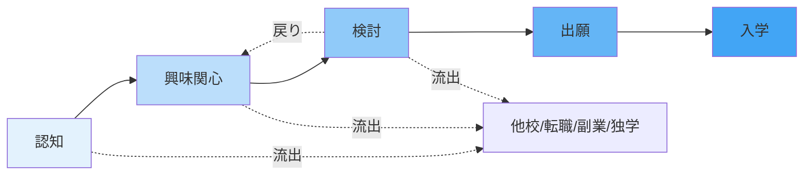
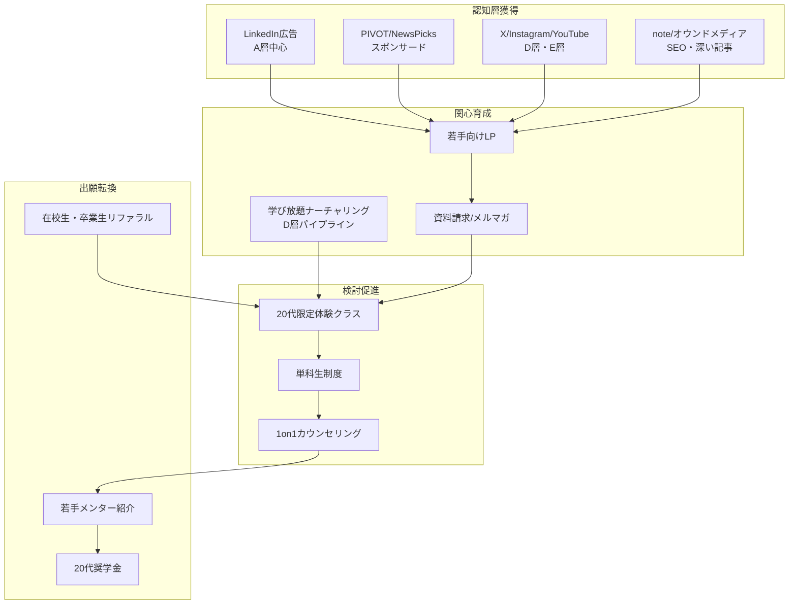
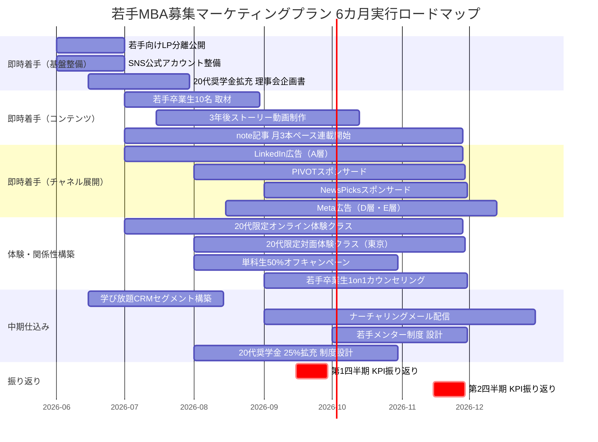
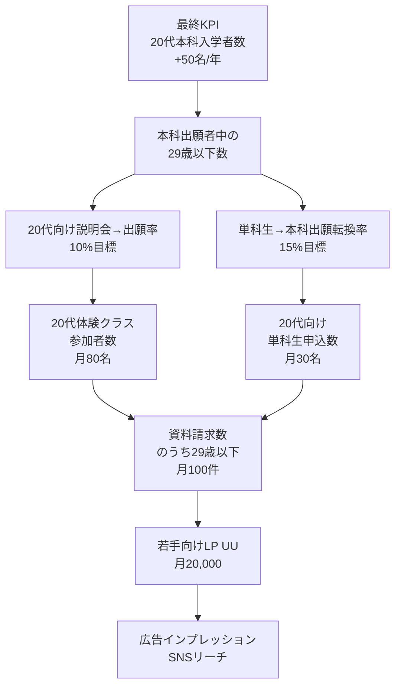

# マーケティングプラン草案：若手MBA募集（20代後半〜30代前半）

**作成日:** 2026-05-28
**前提資料:**
- [outputs/市場検証_若手MBA市場_20260528.md](市場検証_若手MBA市場_20260528.md)
- [outputs/戦略設計_若手MBA募集_20260528.md](戦略設計_若手MBA募集_20260528.md)
- [outputs/検証結果_市場検証_若手MBA市場_20260528_20260528.md](検証結果_市場検証_若手MBA市場_20260528_20260528.md)

**位置づけ:** 戦略設計で定義した3つの根幹施策（価格構造再設計／若手コミュニティ物理構築／学び放題ナーチャリング）を、6カ月の実行プランに落とす草案。投資見積もり・KPI・スケジュールは仮置きで、確定には事業計画化（次フェーズ）が必要。

## 1. エグゼクティブサマリー（400字以内）

20代後半〜30代前半の上昇志向中堅（A層）とキャリア不安層（D層）に対し、「働きながら、20代から、本気で経営を学ぶ最大のコミュニティ」を訴求し、若手入学者比率を1年で+5ポイント引き上げる。施策は3層構造：(1)即時開始（3カ月以内）として若手向けLP分離・若手卒業生3年後ストーリーの月1本発信・20代限定体験クラスの常設化・学び放題20代会員へのナーチャリングメール、(2)中期仕込み（6〜12カ月）として20代奨学金の25%給付化・若手卒業生メンター制度・CRMセグメント整備、(3)既存30代後半層の毀損回避として全社共通の説明会・主要広告チャネルは継続し若手施策は別予算・別チャネルで運用。年間マーケティング予算1.8億円を試算、A層は LinkedIn・PIVOT・NewsPicks、D層は学び放題CRM・X・YouTubeに重点配分。KPIは20代本科出願数・若手入学比率・CPAを四半期で振り返る。

## 2. ターゲットインサイト（ペルソナ3パターン）

戦略設計のA層・D層・E層に対応する3ペルソナを精緻化する。年収は[国税庁令和6年分民間給与実態統計調査](https://www.nta.go.jp/publication/statistics/kokuzeicho/minkan/gaiyou/2024.htm)および[マイナビ20代正社員意識調査2024](https://career-research.mynavi.jp/reserch/20240520_75161/)を参考に設定。

### 2.1 ペルソナA：田中翔太（A層代表 — 主戦場）

| 項目 | 内容 |
|------|------|
| 名前・年齢 | 田中翔太、29歳 |
| 職種 | 大手メーカー（東証プライム）営業企画、入社7年目、係長 |
| 年収・勤務地 | 720万円、東京勤務 |
| 学歴 | MARCH文系・新卒入社 |
| 家族構成 | 独身、結婚を視野に交際中 |
| 居住 | 東京23区賃貸（家賃12万円） |
| **キャリアの悩み** | 営業企画として4年。次の課長昇進候補から漏れた予感がある。同期の数名がコンサル・SaaS企業に転職し年収が逆転した。海外駐在の話が来たが、行けば「営業の人」で固定化する不安。マネジメントを体系的に学んだ経験がなく、抽象的な議論が苦手 |
| **願望** | 経営の言語を持ち、経営企画やCxO候補として認識されたい。年収1,000万を超えたい。30代で起業の選択肢を持ちたい |
| **情報接触行動** | • SNS：X（情報収集・PIVOT/NewsPicks動画拡散をフォロー）、LinkedIn（同期の動向確認） • メディア：PIVOT、NewsPicks（有料会員）、東洋経済オンライン、ハーバード・ビジネス・レビュー日本版 • 検索：「MBA 30代 後悔」「グロービス 評判」「MBA 転職 効果」「経営企画 転職」 • 動画：YouTube（ビジネス系・トレーニング系）、Voicy（移動中） |
| **MBA検討の意思決定プロセス** | 1. 検索流入（半年前から不定期） 2. 資料請求→説明会参加 3. グロービス学び放題3カ月体験 4. 単科生1〜2科目（6カ月） 5. 本科出願 ※検討開始から出願まで通常12〜18カ月 |
| **障壁** | • 「2年続けられるか」の継続不安 • 学費345万円→給付控除後217万円の負担感（年収比30%） • 「会社に黙って通うか／報告するか」の社内政治不安 • クラスメイトに30代後半・40代が多いと聞く |

### 2.2 ペルソナD：鈴木美咲（D層代表 — 育成プール）

| 項目 | 内容 |
|------|------|
| 名前・年齢 | 鈴木美咲、27歳 |
| 職種 | 中堅IT企業（従業員300名）カスタマーサクセス、入社5年目、メンバー職 |
| 年収・勤務地 | 410万円、東京勤務 |
| 学歴 | 中堅私大・新卒入社 |
| 家族構成 | 独身、実家暮らし |
| 居住 | 東京近郊（実家通勤） |
| **キャリアの悩み** | 仕事はそれなりに楽しいが、5年経って「このまま行ったらどうなるのか」が見えない。SNSで同年代が転職や副業の成功を語っているのを見て焦る。何を学べばいいのか分からないまま、英語学習やWebデザイン講座を中途半端に始めて続かない。グロービス学び放題に1年前から加入しているが、月数本動画を見て満足している状態 |
| **願望** | キャリアの方向性を見つけたい。年収を上げたい（具体額の目標はまだない）。「成長している自分」の実感が欲しい |
| **情報接触行動** | • SNS：Instagram（メイン）、X（ビジネス系インフルエンサー）、TikTok（ライフハック系）、note（働き方・キャリア記事） • メディア：DIAMOND online、PRESIDENT online、東洋経済オンライン • 検索：「何をすればいいか分からない」「20代 後半 焦り」「キャリア 迷い」「リスキリング 何から」 • 動画：YouTube（自己啓発系、Vlog系） |
| **MBA検討の意思決定プロセス** | 1. グロービス学び放題会員（既に1年） 2. SNS流入や同年代の発信で「MBA」という選択肢を知る 3. 体験クラスやウェビナーで「自分にもできそう」と実感 4. 単科生で1科目試す（実費負担への抵抗あり） 5. 本科出願（早くて1〜2年後） |
| **障壁** | • 「自分にMBAは無理」「優秀な人が行くもの」という認識 • 年収410万円に対する学費345万円が「2倍以上の重さ」に感じる • 周囲（実家・友人）にMBAホルダーがいないため相談相手がいない • 結婚・出産を考えるとタイミングが分からない |

### 2.3 ペルソナE：佐藤麻衣（E層代表 — 差別化補完）

| 項目 | 内容 |
|------|------|
| 名前・年齢 | 佐藤麻衣、32歳 |
| 職種 | 大手金融（東証プライム）法人営業、入社10年目、主任。第一子（1歳）出産後の育休復帰1年目 |
| 年収・勤務地 | 650万円（時短勤務中）、東京勤務 |
| 学歴 | 旧帝大文系・新卒入社 |
| 家族構成 | 既婚（夫32歳、年収780万）、子1名（1歳） |
| 居住 | 東京近郊持ち家（住宅ローン返済中） |
| **キャリアの悩み** | 育休復帰後、時短勤務でメインの法人営業から外れた。「マミートラック」を強く意識。10年勤めても専門性が積み上がっていない感覚。第二子も検討中で、また育休に入ると今度こそ復帰できないのではという恐怖 |
| **願望** | 育児と両立できる範囲で、自分の市場価値を高めたい。子供に「働く母」のロールモデルを見せたい。40代で経営層に近いポジションに行きたい |
| **情報接触行動** | • SNS：Instagram（ワーママ系・育児系）、X（ビジネス系・育児両立系）、Voicy（家事・育児中の音声） • メディア：日経DUAL、PRESIDENT WOMAN、Forbes JAPAN • 検索：「ワーママ MBA」「働きながら 大学院 育児」「グロービス 女性」「キャリア 復帰」 • 動画：YouTube（時短家事・教育系）、Voicy |
| **MBA検討の意思決定プロセス** | 1. ワーママ系インフルエンサーやnote記事でMBA取得者の存在を知る 2. 資料請求→女性卒業生のインタビューを熟読 3. オンライン体験クラスに参加 4. 単科生制度を活用、夜の在宅時間で受講開始 5. 本科出願（夫との合意形成に3〜6カ月） |
| **障壁** | • 育児時間との両立可能性 • 学費345万円＋住宅ローンの二重負担 • 夫の理解と家事育児の分担再交渉 • 「子供がまだ小さいのに」という周囲からの罪悪感誘発 |

## 3. ポジショニングとメッセージ戦略

### 3.1 ポジショニング（戦略設計の再提示）

**全体ポジショニング：**

> 「**働きながら、20代から、本気で経営を学ぶ、日本最大のコミュニティ。**実践即活用のケースメソッドで、明日の仕事から成果が出る。CxO経験者2,061名を含む14,000人超の同窓ネットワークが、卒業後も10年・20年あなたを押し上げる。」（[グロービス公式PR 2026/4/1](https://globis.co.jp/news/mba/12831-2026-04-01/)）

### 3.2 既存30代後半以降層を毀損しない原則

- 全体メッセージは「年代問わず実践志向のMBA」を維持。30代後半・40代向け既存メッセージ（CxO候補、リーダーシップ深化、第二の人生）は継続
- 「若手向け」訴求は**別チャネル・別LP・別広告クリエイティブ**で完全分離。既存メインのコーポレートサイト・主要広告では年代別の差別化メッセージを出さない
- 体験クラスは「全年代向け」と「20代限定」の2系統運用。両者を別カレンダーで運営

### 3.3 ペルソナ別キーメッセージ案（5パターン）

| メッセージID | コピー案 | 対象ペルソナ | 訴求軸 |
|--------------|----------|--------------|--------|
| M1 | **「30歳までに、経営の言語を身につける。」** 同期がMBAで武器を手に入れ始めた今、あなたはどう答えるか。 | A層（田中翔太） | 競争意識・自己投資のタイミング |
| M2 | **「来週の会議で、明日から使える。」** ケースメソッドが3,450,000円のROIを最短で取り戻す。 | A層 | 実践即活用・ROI |
| M3 | **「月1,650円で始めて、人生が変わった人が、ここに14,000人。」** 学び放題から本科まで、あなたのペースで自分の限界線を更新していい。 | D層（鈴木美咲） | 段階アクセス・低リスク |
| M4 | **「20代でMBAなんて、と思った。1年後、後悔した。」** 20代卒業生たちの、3年後のキャリアと年収を、すべて公開します。 | A層・D層 | 後悔回避・定量化された証拠 |
| M5 | **「育休復帰後、もう一度自分の名前で働く。」** 夜の2時間で、10年後の私を作る。グロービスのオンラインMBA。 | E層（佐藤麻衣） | ワーママ・自己実現・両立 |

### 3.4 メッセージ運用の禁則

- 「20代でMBAは早すぎる説への反論」は表明する必要があるが、年上層を否定する表現は禁止（例：「30代後半は遅い」「40代は手遅れ」など）
- 競合校（早稲田・慶應・一橋）の名指し批判は禁止
- 「絶対に年収が上がる」「100%キャリアアップ」など断定的成果保証は禁止
- グロービス自社調査の数値を引用する際は「グロービス独自調査」と必ず明記（[グロービス公式PR 2024/11/26](https://globis.co.jp/news/elearning/10696-2024-11-26/)）

## 4. カスタマージャーニーと施策マッピング

5フェーズ（認知 → 興味関心 → 検討 → 出願 → 入学）で、施策と各フェーズのKPIを明示する。

### 4.1 ジャーニーマップ（全体像）

### 4.2 フェーズ別施策・KPI表

| フェーズ | 顧客状態 | 主な施策（即時=3カ月以内／中期=6〜12カ月） | 主KPI | 副KPI |
|----------|----------|----------------------------------------------|-------|-------|
| **認知** | グロービスのことを名前は知っているが内容は知らない／20代向けという認識がない | 【即時】若手向けLP分離公開・X/Instagram/YouTube/note公式アカウント整備・PIVOT/NewsPicksスポンサード記事 【即時】若手卒業生3年後ストーリー動画 月1本発信開始 【中期】LinkedIn広告本格展開（A層ターゲティング） | 若手向けLPの月間UU、SNSフォロワー数（X：5,000人/Instagram：3,000人/YouTube：2,000登録 を6カ月目標） | 動画再生数、note記事PV、検索流入数 |
| **興味関心** | 「自分にも関係あるかも」と思った／資料請求や説明会に申し込んだ | 【即時】20代向け資料請求LP分離・若手卒業生の成功事例集（PDF）配布 【即時】20代限定オンライン説明会 月2回開催 【中期】学び放題会員（20代）へのメールジャーニー設計 | 資料請求数（月100件目標）、20代向け説明会参加者数（月60名目標） | メール開封率（30%目標）、CTR（5%目標） |
| **検討** | 体験クラスや単科生で「試運転」している／他選択肢（他大MBA、転職、独学）と比較中 | 【即時】20代限定体験クラス 月2回（オンライン1・対面1） 【即時】単科生「20代お試し1科目目50%オフ」キャンペーン 【即時】若手卒業生による1on1カウンセリング（無料・30分） 【中期】CRM上で各接点行動データを統合し、リードスコアリング | 20代体験クラス参加者数（月80名）、単科生新規申込者数のうち29歳以下比率（30%目標）、1on1カウンセリング実施数（月40件） | 体験クラス満足度（4.5/5目標）、検討期間中のフォローメール反応率 |
| **出願** | 本科出願を意思決定／出願書類を準備中 | 【即時】20代向け出願ガイド（書類記載例・面接対策）配布 【即時】若手在校生・卒業生メンターの紹介（出願期間中の質問対応） 【即時】20代奨学金の事前申請窓口設置 【中期】20代奨学金を25%給付に拡充（理事会承認後、2028年4月入学から） | 本科出願者数のうち29歳以下絶対数（年間目標：現状＋50名、6カ月で進捗確認）、出願後の辞退率（10%以下） | 出願書類の完成率、面接通過率 |
| **入学** | 入学後の継続・成功を支援／次の若手獲得の証言者へ | 【即時】20代だけの「同期キックオフ」イベント 【即時】若手キャリアトラック（科目組合せ提案） 【中期】若手卒業生メンター制度の必修化 【中期】卒業3年後の年収・キャリア変化トラッキング体制構築 | 20代入学者の1年後継続率（95%以上）、20代卒業3年後の年収中央値変化（+15〜25%目標） | 在校生満足度、若手アンバサダー候補数 |

## 5. チャネル戦略

### 5.1 チャネル別の役割分担

### 5.2 チャネル別の特徴と用途

| チャネル | 主ターゲット | 役割 | 強み | 弱み |
|----------|--------------|------|------|------|
| LinkedIn広告 | A層 | 認知・興味喚起 | 職種・年収・業種でフィルタ可、A層との親和性高 | CPC高め（推定400-700円） |
| PIVOT・NewsPicks スポンサード | A層・E層 | 認知・信頼形成 | 20代後半ビジネスパーソンの主要メディア | コスト高（記事1本300-500万円） |
| X（旧Twitter） | A層・D層 | 認知・関心育成・拡散 | 若手卒業生発信が拡散しやすい | アルゴリズム変動リスク |
| Instagram | D層・E層 | 認知・関心育成 | 視覚訴求・ワーママ層への到達 | 直接の出願転換は弱い |
| YouTube | 全層 | 検討期の深い情報提供 | 若手卒業生3年後ストーリーの主軸メディア | 動画制作コスト |
| note | D層・E層 | SEO・深い記事 | 「キャリア」「働き方」検索流入 | 制作工数 |
| オウンドメディア（GLOBIS知見録等） | 全層 | 信頼形成・SEO | 既存資産・ドメインパワー強 | 若手向け記事比率が低い現状 |
| 学び放題CRM | D層 | 段階転換 | 120万人会員という構造的優位 | 既存運営チームとの調整 |
| 体験クラス（20代限定） | 全層 | 検討促進・心理障壁解消 | 「年上だらけ問題」の直接解消 | 開催コスト・講師時間 |
| 在校生・卒業生リファラル | 全層 | 出願転換・信頼形成 | 最も信頼度の高い情報源 | 仕組み化が必要 |

### 5.3 予算配分の考え方（年間1.8億円のマーケティング予算を想定）

戦略設計の年間投資3-4億円のうち、マーケティング活動分を1.8億円と仮置き。残りは奨学金原資・コンテンツ制作運営費等の構造投資。

| カテゴリ | 配分 | 金額（試算） | 想定使途 |
|----------|------|--------------|----------|
| **Web広告（LinkedIn・Meta・Google・YouTube）** | 35% | 6,300万円 | LinkedIn 3,000万円（A層）、Meta 1,500万円（D層・E層）、Google検索 1,000万円（顕在層）、YouTube 800万円 |
| **PIVOT・NewsPicksスポンサード** | 15% | 2,700万円 | 月1本記事＋四半期動画スポンサー |
| **コンテンツ制作（若手卒業生3年後ストーリー等）** | 15% | 2,700万円 | 月1本動画＋note記事制作・撮影・編集・配信 |
| **オウンドメディア・SEO** | 10% | 1,800万円 | 知見録の若手向け記事増産、SEO対策 |
| **体験クラス・イベント運営** | 10% | 1,800万円 | 20代限定オンライン・対面開催、講師謝礼、会場 |
| **CRM・MA・分析ツール** | 5% | 900万円 | MA SaaS、CRM、BIツール |
| **リファラル・卒業生コミュニティ** | 5% | 900万円 | 紹介プログラム原資、コミュニティ運営 |
| **予備費・検証実験** | 5% | 900万円 | A/Bテスト、新チャネル開拓 |
| **合計** | 100% | **1.8億円** | |

### 5.4 既存30代後半以降層の予算は分離

上記1.8億円は**新規追加投資**として、若手獲得に絞った予算。既存の30代後半以降向けマーケティング（社費派遣営業、CxO向けセミナー、エグゼクティブ向けPR等）の予算は**別系統で維持**し、本プランで毀損しない。両者の予算は最低でも別管理し、四半期で全社配分の見直しを行う。

## 6. 実行ロードマップ（最初の6カ月：2026年6月〜11月）

### 6.1 フェーズ別の打ち手と必要リソース

| 月 | フェーズ | 主要打ち手 | 必要リソース | 必要承認 |
|----|----------|------------|--------------|----------|
| **2026年6月** | 即時着手① 基盤整備 | 若手向けLP分離公開／SNS公式アカウント整備／ペルソナ精緻化／既存学び放題CRMから20代会員リスト抽出／20代奨学金拡充の理事会向け企画書作成 | マーケ担当2名、外部LP制作（500万円）、データ分析1名 | LP公開：マーケ部長／20代奨学金企画：経営会議 |
| **2026年7月** | 即時着手② コンテンツ供給開始 | 若手卒業生10名の取材開始／20代限定オンライン体験クラス 第1回開催／LinkedIn広告キャンペーン開始（A層）／note記事 第1〜3本公開 | 取材ライター2名、動画制作会社、広告運用1名 | 取材対象者：人事と要調整 |
| **2026年8月** | 即時着手③ 検討期施策 | 3年後ストーリー動画 第1本公開／単科生「20代お試し1科目目50%オフ」キャンペーン開始／PIVOTスポンサード第1本／20代限定対面体験クラス 第1回（東京） | 動画制作、編集、メディア出稿、対面イベント運営 | 単科生割引：教務部承認 |
| **2026年9月** | 中間振り返り | 第1四半期KPI測定／LP/広告のA/Bテスト最適化／学び放題ナーチャリングメール 第1〜3通配信開始／NewsPicksスポンサード第1本／若手卒業生1on1カウンセリング受付開始 | データ分析、CRM運用1名 | — |
| **2026年10月** | 中期仕込み① 出願期接続 | 本科出願期に合わせた若手向け説明会強化（オンライン週2・対面月2）／20代奨学金の出願受付開始／若手メンター制度の設計案完成 | 説明会運営、メンター制度設計責任者 | メンター制度：人事・教務 |
| **2026年11月** | 中期仕込み② 第2期出願 | 本科春入学出願ピーク／若手向け追加プロモ／第2四半期振り返り／2027年度マーケ計画策定 | 全社協力体制 | 2027年度予算：経営会議 |

### 6.2 ガントチャート

### 6.3 リソース総覧

| リソース | 必要人数・体制 | 既存活用／新規 |
|----------|----------------|---------------|
| マーケティング戦略・統括 | 1名（プランナー兼PM） | 新規（若手獲得専任） |
| デジタル広告運用 | 1名 | 既存マーケチームから |
| コンテンツ制作（記事・動画） | 外部制作会社2社＋社内編集1名 | 新規発注＋既存 |
| データ分析・CRM運用 | 1名 | 既存分析チームから |
| 体験クラス運営 | 既存運営チーム＋若手担当1名追加 | 新規担当1名 |
| 若手卒業生メンター | 30名規模（謝金または年間プログラム参加） | 新規制度 |
| 教務部・経営層との調整 | 全期間 | 既存 |

## 7. KPI設計と効果測定

### 7.1 KPIツリー

### 7.2 KPI目標と振り返りサイクル

| 階層 | 指標 | 6カ月目標 | 12カ月目標 | 計測方法 | 振り返り頻度 |
|------|------|-----------|-----------|----------|--------------|
| **認知** | 若手向けLPのUU | 月10,000 | 月20,000 | GA4 | 月次 |
| **認知** | X/Instagram/YouTubeフォロワー数 | 合計10,000 | 合計30,000 | 各プラットフォーム | 月次 |
| **興味関心** | 若手向け資料請求数 | 月50 | 月100 | CRM | 月次 |
| **興味関心** | 20代向け説明会参加者数 | 月40 | 月80 | CRM | 月次 |
| **検討** | 単科生新規申込のうち29歳以下数 | 月15 | 月30 | 教務システム | 月次 |
| **検討** | 20代体験クラス参加者数 | 月50 | 月80 | イベント管理 | 月次 |
| **検討** | 1on1カウンセリング実施数 | 月20 | 月40 | カウンセリング担当 | 月次 |
| **出願** | 29歳以下本科出願者数 | 半期で前年比+30名 | 通年で前年比+80〜100名 | 教務システム | 四半期 |
| **入学** | 29歳以下本科入学者数 | — | +50名（対前年比） | 教務システム | 半期 |
| **入学** | 本科入学者中の29歳以下比率 | — | +3〜5ポイント | 教務システム | 半期 |
| **効率** | 29歳以下 CPA（Cost Per Application） | 計測開始 | 50万円以下／件 | マーケ予算÷29歳以下出願者数 | 四半期 |
| **効率** | 29歳以下 CAC（Cost Per Acquisition＝入学） | 計測開始 | 150万円以下／件 | マーケ予算÷29歳以下入学者数 | 半期 |

### 7.3 計測の前提と注意

- 現状の29歳以下入学者の絶対数・CPA・CAC・体験クラス参加者数等は**社内データ未取得**のため、上記目標は仮置き。最初の四半期で実数値ベースラインを取得し、目標値を再設定する
- 「29歳以下比率」の現状を把握するには、グロービス公式の[学生プロファイル](https://mba.globis.ac.jp/alumni/profile/data.html)ページの年代別グラフから読み取るか、内部データへのアクセスが必要
- ペルソナ別の流入経路追跡には、UTMパラメータ・LP分離・CRMでの属性タグ管理が必須

### 7.4 振り返りサイクル

| サイクル | 頻度 | 内容 | 参加者 |
|----------|------|------|--------|
| 週次 | 毎週月曜 | 広告運用・SNS反応の数値共有、緊急課題の特定 | マーケ実務チーム |
| 月次 | 月初第1週 | 認知・興味関心レイヤーのKPI振り返り、施策チューニング | マーケチーム＋関連部門担当者 |
| 四半期 | 四半期末＋2週 | 全KPIの振り返り、施策の追加・中止、予算配分の見直し | マーケ部長＋経営層 |
| 半期 | 半期末＋1カ月 | 戦略の妥当性検証、次半期の予算・体制決定 | 経営会議 |

## 8. リスクと制約条件

| リスク | 影響 | 対策 |
|--------|------|------|
| 20代奨学金拡充の理事会承認が遅延 | 価格レバーが効かず、A層のROI不安解消ができない | 第1四半期中に企画書完成・承認獲得。承認前は単科生制度の20代割引で代替訴求 |
| 若手卒業生10名の取材協力が得られない | コンテンツ供給がボトルネック | 在校生・卒業生コミュニティに先行打診、現役在校生も補完素材として活用 |
| 既存30代後半以降層から「若手優遇」のクレーム | ブランド毀損リスク | 若手向け施策は別チャネル・別予算で運用し、メインメッセージは年代不問のまま維持 |
| 学び放題CRMデータの活用許可が取れない | D層パイプラインが機能しない | プライバシーポリシー・利用規約の見直しを並行進行、必要に応じてオプトイン取得施策を追加 |
| 競合の早稲田WBS夜間主が同様の若手特化施策を展開 | 差別化軸の弱体化 | グロービスの優位（規模・段階性・コミュニティ）を継続的に強調、施策の先行優位を維持 |
| 教育訓練給付制度の改正 | 価格訴求の前提が変化 | [厚労省](https://www.mhlw.go.jp/stf/seisakunitsuite/bunya/koyou_roudou/jinzaikaihatsu/kyouiku.html)の制度変更を定期確認、年1回はメッセージの再点検 |

## 9. 次フェーズへの引き継ぎ事項

本マーケティングプラン草案を踏まえて、確定計画化（経営会議承認用）で詰めるべき事項：

1. **2026年6月以降の年度予算1.8億円の社内予算化**（既存マーケ予算との関係整理を含む）
2. **20代奨学金拡充の理事会承認スケジュール**（実装は2028年4月入学から想定）
3. **学び放題運営組織（株式会社グロービス）と本科運営（学校法人グロービス経営大学院）の組織横断プロジェクト体制**
4. **若手卒業生10名の選定と取材合意取得**
5. **CRM・MAツールの導入または既存活用の選定**
6. **若手メンター制度の運営主体・謝金体系・年間運営フローの確定**
7. **既存30代後半以降層向けマーケティングとの予算分離ルール明文化**
8. **2027年度・2028年度の中期マーケティング計画への接続設計**

## 出典一覧

- [グロービス公式PR 2026/4/1 入学式](https://globis.co.jp/news/mba/12831-2026-04-01/)
- [グロービス公式PR 2026/2/20 20代MBA進学応援奨学金](https://globis.co.jp/news/mba/12525-2026-02-20/)
- [グロービス公式PR 2025/4/25 学び放題120万人・4,000社](https://globis.co.jp/news/elearning/11342-2025-04-25/)
- [グロービス公式PR 2024/11/26 20〜30代キャリア観調査](https://globis.co.jp/news/elearning/10696-2024-11-26/)
- [グロービス公式 学費ページ](https://mba.globis.ac.jp/admissions/entry/expences.html)
- [グロービス公式 学生プロファイル](https://mba.globis.ac.jp/alumni/profile/data.html)
- [マイナビキャリアリサーチLab 20代正社員意識調査2024（2024/5/20）](https://career-research.mynavi.jp/reserch/20240520_75161/)
- [国税庁 令和6年分民間給与実態統計調査](https://www.nta.go.jp/publication/statistics/kokuzeicho/minkan/gaiyou/2024.htm)
- [矢野経済研究所プレスリリース 2025/4/22 eラーニング市場](https://www.yano.co.jp/press-release/show/press_id/3795)
- [厚生労働省 教育訓練給付金](https://www.mhlw.go.jp/stf/seisakunitsuite/bunya/koyou_roudou/jinzaikaihatsu/kyouiku.html)
- [早稲田WBS公式 学費ページ](https://www.waseda.jp/fcom/wbs/applicants/tuition)
- [一橋ICS公式 MBA Tuition](https://www.ics.hub.hit-u.ac.jp/mba/tuition-and-fees)
