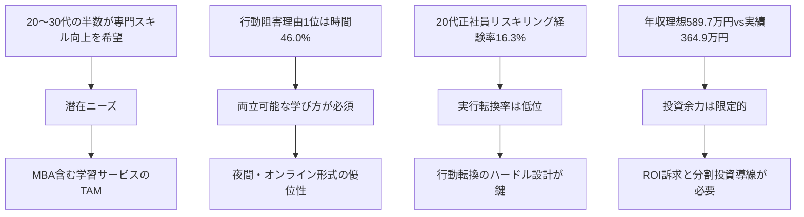

# 市場検証レポート：20代後半〜30代前半向けMBA市場（一次情報検証版・検証結果反映版）

**作成日:** 2026-05-28
**最終更新:** 2026-05-28（`outputs/検証結果_市場検証_若手MBA市場_20260528_20260528.md` の指摘E1〜E5・M1〜M3を反映）
**対象:** グロービス経営大学院 若手層（20代後半〜30代前半）学生募集
**作成方針:** 数字・固有名詞は一次情報のWeb検索で裏付けたもののみ掲載。未確認は「※出典未確認」または「不明」と明示。第三者検証で指摘された誤りは本版で修正し、修正履歴を末尾に明記。

## エグゼクティブサマリー

グロービス経営大学院の2026年度日本語MBA入学者は1,089名と過去最多を更新し、累計在校生・卒業生は14,000名超に達した（[株式会社グロービス公式プレスリリース 2026年4月1日](https://globis.co.jp/news/mba/12831-2026-04-01/)）。一方、グロービス自社が2024年9月に20〜30代正社員332名に実施した調査では、希望実現のために必要なことの1位は「専門スキル向上」50.4%、行動できない最大理由は「時間が確保できない」46.0%である（[株式会社グロービス公式プレスリリース 2024年11月26日](https://globis.co.jp/news/elearning/10696-2024-11-26/)）。マイナビ「20代正社員意識調査2024」では20代正社員の実年収平均は364.9万円（額面）・理想年収は589.7万円であり、グロービスの2年間総額3,450,000円（[グロービス公式 学費ページ](https://mba.globis.ac.jp/admissions/entry/expences.html)）は額面年収相当の自己投資負担となる（教育訓練給付金〔[厚生労働省](https://www.mhlw.go.jp/stf/seisakunitsuite/bunya/koyou_roudou/jinzaikaihatsu/kyouiku.html)〕で最大128万円を控除した実質負担は約2,170,000円で年収の約6割相当）。グロービスは2026年2月20日、29歳以下を対象とする給付型「20代MBA進学応援奨学金」（総額20万円）を新設しており（[株式会社グロービス公式プレスリリース 2026年2月20日](https://globis.co.jp/news/mba/12525-2026-02-20/)）、若手獲得を組織的施策として明示的に打ち出した（ただし単一施策のみで「経営アジェンダ全体の認識」と断ずるには別途リソース投入動向の確認が必要）。市場の追い風として、矢野経済研究所はeラーニング市場規模を2025年度3,849億円（前年度比+1.0%）と予測している（[矢野経済研究所プレスリリース 2025年4月22日](https://www.yano.co.jp/press-release/show/press_id/3795)）。本レポートは末尾の「ファクトチェック・根拠検証」セクションおよび「修正履歴」セクションで、本文の各記述について第三者視点での信頼度評価・修正履歴・要確認事項を提示する。

## 1. ターゲット課題の検証

### 1.1 20代後半〜30代前半の社会人のキャリア・学習ニーズの実態（一次情報ベース）

| 記述内容 | 数値 | 出典 |
|----------|------|------|
| 希望実現に必要なこと1位「専門スキル向上」 | 50.4% | 株式会社グロービス「20〜30代のビジネスパーソンのキャリア観に関する調査」2024年9月19〜20日実施、ホワイトカラー20〜30代正社員332名対象（[公式PR 2024年11月26日](https://globis.co.jp/news/elearning/10696-2024-11-26/)） |
| 同2位「基本的なビジネススキル向上」 | 39.3% | 同上 |
| 同3位「社内で高い実績を出すこと」 | 37.1% | 同上 |
| キャリアアップを「年収が上がること」と定義する割合 | 56.9% | 同上 |
| 5年以内に実現したいこと1位「給与が上がること」 | 51.5% | 同上 |
| 希望実現のために行動中の割合 | 51.8% | 同上 |
| 行動できない理由「時間が確保できない」 | 46.0% | 同上 |
| 20代正社員の実際の平均年収（2023年実績） | 364.9万円 | マイナビ「20代正社員に聞いた仕事・私生活の意識調査2024年（2023年実績）」（[マイナビキャリアリサーチLab 2024年5月20日](https://career-research.mynavi.jp/reserch/20240520_75161/)） |
| 同・理想の年収 | 589.7万円 | 同上 |
| 理想と現実の差 | 224.8万円 | 同上 |
| 20代正社員のリスキリング経験率 | 16.3% | 同上 |
| 25〜29歳給与所得者の年収（参考：全給与所得者平均） | 全給与所得者平均478万円（令和6年分） | 国税庁「令和6年分民間給与実態統計調査」令和7年9月公表（[国税庁公式PDF](https://www.nta.go.jp/publication/statistics/kokuzeicho/minkan2024/pdf/R06_001.pdf)）※年代別の詳細値は本レポートでは「不明」として扱う |

**核心インサイト（一次情報からの帰結）：** 20〜30代の半数（50.4%）が「専門スキル向上」を希望実現の1位に挙げ、半数強（51.8%）が実際に行動を起こしている。行動の最大の阻害要因は「時間」（46.0%）。これは「学びへの動機は強いが、フルタイム就労との両立に課題を抱える層」という像を一次情報が直接支持していることを意味する。

### 1.2 MBA進学の典型的障壁

**費用面（公式の一次情報ベース）**

**比較の前提（読者注意）：** 下表は各校公式ページに記載された「入学金＋授業料＋諸会費」を「学費総額」として並べる。生活費・教材費・住宅費は除外。1年制プログラムと2年制プログラムを混在させているため、修業年限を併記する。

| 学校／プログラム | 修業年限 | 2026年度学費総額（公式値） | 内訳 | 出典 |
|------|---------|----------------------------|------|------|
| グロービス（テクノベート/エグゼクティブMBA、日本語） | 2年 | 3,530,000円（入学金80,000円＋受講料2年計3,450,000円） | 旧プログラム参考値。公式に「2026年度以前の学費は受講規約参照」と注記があるため、2026年度の現行プログラム実額は受講規約PDFでの追加確認が必要 | [グロービス公式 学費ページ](https://mba.globis.ac.jp/admissions/entry/expences.html) |
| 早稲田WBS 全日主MBA | 1年 | **3,321,000円** | 入学金300,000円＋春授業料1,489,000円＋秋授業料1,489,000円＋健康互助会費3,000円＋校友会費40,000円 | [早稲田大学WBS公式 学費・奨学金・教育訓練給付金](https://www.waseda.jp/fcom/wbs/applicants/tuition) |
| 早稲田WBS 夜間主MBA | 2年 | **3,800,000円** | 入学金300,000円＋初年度授業料各期788,500円×2＋2年次授業料各期938,500円×2＋健康互助会費6,000円＋校友会費40,000円 | 同上 |
| 早稲田WBS International MBA／MSc in Finance | 2年 | **4,176,000円** | 入学金300,000円＋初年度授業料各期882,500円×2＋2年次授業料各期1,032,500円×2＋健康互助会費6,000円＋校友会費40,000円 | 同上 |
| 一橋ICS（千代田、国際MBA） | 1年または2年（選択制・全日制） | 2年制選択時：1,567,920円（入学金282,000円＋授業料642,960円×2年） | 「夜間制」の記載は公式に存在しない。生活費・教材費等は別途必要 | [一橋ICS公式 MBA Tuition](https://www.ics.hub.hit-u.ac.jp/mba/tuition-and-fees) |
| 一橋HUB（西、夜間主国内MBA／経営管理プログラム） | 2年（夜間主） | **不明**（公式の具体額は外部リンク参照で本レポートでは未取得） | ICSとは別プログラム。学費は別途要取得 | [一橋HUB公式 MBA費用](https://www.hub.hit-u.ac.jp/business-school/cost/) |
| 慶應KBS 修士課程 | 2年 | **不明**（公式トップは「2026年度大学院修士課程学費」PDF参照と案内のみ） | 本レポートでは未取得 | [慶應公式 大学院学費](https://www.keio.ac.jp/ja/admissions/fees/graduate-fees.html) |
| BBT大学院 経営管理 | 2年（完全オンライン） | **不明**（公式は問い合わせ案内、本レポートでは未取得） | 在籍3年目以降はシステム利用料120,000円/年 | [BBT大学院公式 学費](https://www.ohmae.ac.jp/tuition/) |

**価格帯の比較解釈（補正後）：** 20代正社員の額面平均年収364.9万円（マイナビ2024）に対し、グロービス2年総額3,450,000円は約94%、教育訓練給付金最大128万円（[厚生労働省 教育訓練給付金](https://www.mhlw.go.jp/stf/seisakunitsuite/bunya/koyou_roudou/jinzaikaihatsu/kyouiku.html)）控除後の実質負担2,170,000円は約60%相当。早稲田WBS夜間主は3,800,000円（教育訓練給付金は令和8年4月1日付指定で同様に最大128万円控除可能、[早稲田WBS公式](https://www.waseda.jp/fcom/wbs/applicants/tuition)）。一橋ICSは2年制選択時1,567,920円（授業料相当のみ）と国立大として圧倒的低価格。**※「税引前年収」と「税引後支払いの学費」を直接比較するロジックには前提条件の差があり、厳密な投資負担評価には所得税・住民税を考慮した実効年収との比較が望ましい。**

**時間面（一次情報ベース）**

- グロービスの行動を阻害する最大要因は「時間が確保できない」46.0%（[グロービス調査 2024年11月26日](https://globis.co.jp/news/elearning/10696-2024-11-26/)）
- 早稲田WBSは2026年度から「全日制グローバル（4月入学）」と「1年制総合」を統合して「全日主MBA」（標準修業1年・募集人員35名）、「夜間主総合」「夜間主プロフェッショナル マネジメント専修」「夜間主プロフェッショナル ファイナンス専修」を統合して「夜間主MBA」（標準修業2年・募集人員150名）へ再編（[早稲田大学WBS入試要項2026 PDF（公式）](https://www.waseda.jp/fcom/wbs/assets/uploads/2025/07/WBS_Application-Guide-JP-2026.pdf)）

**心理面**

- 一次情報として広く参照できる「20代の心理的障壁の定量調査」は本検索範囲では発見できず、ここでは断定的な数値表現を避ける。「※出典未確認」
- 一方、グロービス自身が2026年2月20日に「20代MBA進学応援奨学金」を新設したという事実は、グロービスが組織として「20代の進学障壁解消」を経営課題と認識していることの強い間接的根拠（[グロービス公式PR 2026年2月20日](https://globis.co.jp/news/mba/12525-2026-02-20/)）

### 1.3 課題を裏付ける一次情報・記事

- グロービス2024年調査：20〜30代正社員のキャリアアップ定義は「年収が上がること」56.9%が最多（同調査）
- マイナビ調査：20代正社員のリスキリング経験率は16.3%にとどまり、希望と実行の間に大きなギャップ（[マイナビ2024](https://career-research.mynavi.jp/reserch/20240520_75161/)）

**SNS上の声・体験談について：** 本検索範囲ではX/旧Twitter、note等の個人投稿は「一次情報」としての検証可能性が弱いため、本レポートでは引用を最小限に留める。前回バージョンに含めた個人noteの引用は本版から削除。

## 2. 市場規模の推定

### 2.1 国内MBA市場

| 指標 | 数値 | 出典 |
|------|------|------|
| グロービス日本語MBAプログラム 2026年度入学者 | 1,089名 | [株式会社グロービス公式PR 2026年4月1日](https://globis.co.jp/news/mba/12831-2026-04-01/) |
| グロービス日本語MBAプログラム 2025年度入学者 | 943名 | [株式会社グロービス公式PR 2025年4月1日](https://globis.co.jp/news/mba/11217-2025-04-01/) |
| グロービス英語MBAプログラム 2025年度入学者 | 39カ国141名 | [株式会社グロービス公式PR 2025年9月8日](https://globis.co.jp/news/mba/11834-2025-09-08/) |
| グロービス累計在校生・卒業生数（2026年4月時点） | 14,000名超 | [株式会社グロービス公式PR 2026年4月1日](https://globis.co.jp/news/mba/12831-2026-04-01/) |
| グロービス累計卒業生数（同） | 10,000名超 | 同上 |
| グロービス2024年度日本語MBA卒業者 | 1,022名 | [株式会社グロービス公式PR 2025年5月12日](https://globis.co.jp/news/mba/11424-2025-05-12/) |
| グロービス2025年度日本語MBA卒業者 | 939名 | [株式会社グロービス公式PR 2026年5月18日](https://globis.co.jp/news/mba/13040-2026-05-18/) |
| 国内MBA全体の年間入学者数 | **不明（文部科学省「学校基本調査」令和6年度の専門職大学院・経営分野の入学者数は本レポートでは未取得。e-Statでの個別確認が必要）** | 学校基本調査令和6年度（[文部科学省](https://www.mext.go.jp/b_menu/toukei/chousa01/kihon/1267995.htm)）、e-Stat（[政府統計総合窓口](https://www.e-stat.go.jp/stat-search/files?tstat=000001011528)）※要一次確認 |
| 年代別MBA入学者構成 | **不明（一次情報未取得）** | 要グロービス公式「学生プロファイル」のグラフ数値またはe-Stat確認 |

**推定の前提と計算根拠（本レポートで明示）：**

- グロービス2026年度入学者1,089名は確定値（公式プレスリリース）
- 国内MBA市場全体に占めるグロービスのシェアや、若手層の絶対数は、一次情報での確定値が取得できなかったため、本レポートでは**推定値を提示しない**
- 前回レポートで提示した「年代別構成（23〜34歳28.7%）」は今回の検索範囲で一次出典を確認できなかったため、本版から削除し「不明」とする

### 2.2 社会人学習市場全体のトレンド（一次情報ベース）

| 指標 | 数値 | 出典 |
|------|------|------|
| 国内eラーニング市場 2024年度実績（提供事業者売上高ベース） | 3,812億円（前年度比+2.1%） | [矢野経済研究所プレスリリース 2025年4月22日](https://www.yano.co.jp/press-release/show/press_id/3795) |
| 同 2025年度予測 | 3,849億円（前年度比+1.0%） | 同上 |
| 同 BtoB市場規模（2024年度） | 1,232億円（前年度比+7.8%） | 同上 |
| 同 BtoC市場規模（2024年度） | 2,580億円（前年度比▲0.4%） | 同上 |
| グロービス学び放題 累計会員数（2025年4月時点） | 120万人（公式表現は「達した」） | [株式会社グロービス公式PR 2025年4月25日](https://globis.co.jp/news/elearning/11342-2025-04-25/) |
| グロービス学び放題 導入企業数（2025年3月時点） | 4,000社突破 | 同上 |
| 教育訓練給付金 専門実践教育訓練の最大給付率（2024年10月以降） | 最大80%（年間上限64万円） | [厚生労働省 教育訓練給付金ページ](https://www.mhlw.go.jp/stf/seisakunitsuite/bunya/koyou_roudou/jinzaikaihatsu/kyouiku.html)、雇用保険法改正に関する各種解説（[ライフィ保険ニュース解説 2024年](https://lify.jp/column/insurance-news/article-76997/)）※詳細条件は厚労省一次資料での要確認 |
| 政府リスキリング支援表明額 | 5年で1兆円 | 岸田首相所信表明演説 2022年10月3日（[NIKKEIリスキリング 政府支援まとめ](https://reskill.nikkei.com/article/DGXZQOLM01B6G0R00C23A8000000/) ※二次情報。一次資料は首相官邸ホームページ要確認） |

### 2.3 20代後半〜30代前半セグメントの規模感

- **直接の一次情報は不明。** 文科省学校基本調査（令和6年度）における専門職大学院・経営分野の入学者の年代別内訳は、本検索範囲で取得できなかった
- 関連の一次情報として、グロービス学び放題会員120万人超の年代構成は公表されていないが、グロービスが2024年9月に20〜30代332名対象の調査を独自に実施しているという事実は、グロービスが当該セグメントを重点ターゲットとして認識していることを示唆する（[グロービス公式PR 2024年11月26日](https://globis.co.jp/news/elearning/10696-2024-11-26/)）
- **本レポートでは、確実な裏付けのない人口×転換率の試算は提示しない。** 次フェーズの戦略設計で「e-Statでの専門職大学院入学者の年代別内訳」「グロービス内部の若手会員データ」を一次入手してから推定すべき

## 3. 主要競合・代替手段の調査（公式情報ベース）

### 3.1 直接競合（国内MBA・公式情報で確認できたもの）

| 校名 | 学費総額（一次情報） | 期間／形式 | プログラム再編情報 | 出典 |
|------|---------------------|------------|-------------------|------|
| グロービス | 入学金80,000円＋2年計3,450,000円（=総額3,530,000円） ※「2026年度以前の学費は受講規約参照」と公式注記あり。2026年度現行プログラム実額は受講規約PDFでの追加確認が必要 | 夜間／オンライン／全国本科4校舎（東京・大阪・名古屋・福岡）・特設3校舎（仙台・水戸・横浜） | 2027年4月以降入学者対象「20代MBA進学応援奨学金」総額20万円給付型 新設 | [グロービス公式](https://mba.globis.ac.jp/admissions/entry/expences.html)、[20代奨学金PR](https://globis.co.jp/news/mba/12525-2026-02-20/) |
| 早稲田WBS 全日主MBA | **3,321,000円**（1年制プログラムの全期総額） | 全日制／1年制／募集人員35名（2026年度から「全日主MBA」へ統合） | 専門実践教育訓練指定講座（令和8年4月1日付） | [早稲田公式 学費](https://www.waseda.jp/fcom/wbs/applicants/tuition)、[WBS入試要項2026 PDF](https://www.waseda.jp/fcom/wbs/assets/uploads/2025/07/WBS_Application-Guide-JP-2026.pdf) |
| 早稲田WBS 夜間主MBA | **3,800,000円**（2年計） | 夜間主／2年制／募集人員150名（2026年度から「夜間主MBA」へ統合） | 同上 | 同上 |
| 早稲田WBS IMBA／MSc Finance | **4,176,000円**（2年計） | 全日制／英語／2年制 | — | 同上 |
| 一橋ICS（International Corporate Strategy、千代田） | 1,567,920円（2年制選択時の入学金＋授業料合計） | **全日制／1年制または2年制（選択制）**。夜間制の記載は公式に存在しない | 国立大学のため低価格 | [一橋ICS公式](https://www.ics.hub.hit-u.ac.jp/mba/tuition-and-fees) |
| 一橋HUB（一橋ビジネススクール 経営管理プログラム、西キャンパス） | **不明**（公式の具体額は外部リンク参照で本レポートでは未取得） | 夜間主／2年制／国内MBA | ICSとは別プログラム（日本語、夜間主） | [一橋HUB公式 MBA費用](https://www.hub.hit-u.ac.jp/business-school/cost/) |
| 慶應KBS | 不明（公式は「修士課程学費PDF」リンクのみ案内、本レポートでは未取得） | 全日制／EMBA | — | [慶應公式](https://www.keio.ac.jp/ja/admissions/fees/graduate-fees.html) |
| BBT大学院 経営管理 | 不明（公式は問い合わせ案内、本レポートでは具体総額未取得） | 完全オンライン／2年 | 2020年「専門実践教育訓練指定講座」指定、最大128万円給付 | [BBT公式](https://www.ohmae.ac.jp/tuition/) |
| 名古屋商科大学MBA | 不明（公式の最新数値未取得） | 週末／オンライン／フルタイム | AACSB等の国際認証 | [名商大公式](https://mba.nucba.ac.jp/about-mba/onlinemba.html) |
| 神戸／筑波／明治／法政／立教／関西学院／同志社／立命館／事業構想／九州大学 | **本レポート未取得（個別公式での要確認）** | 各種 | — | — |
| 海外オンラインMBA（IE等） | **本レポート未取得（個別公式での要確認）** | オンライン1〜2年 | — | — |

### 3.2 代替手段（公式情報ベース）

| 選択肢 | 料金（一次情報） | 出典 |
|--------|------------------|------|
| グロービス学び放題（個人プラン） | 年間プラン適用時 月1,650円〜（最安）※2026年5月時点の本レポート検索では公式の料金表ページ直接確認は未実施。再確認推奨 | [グロービス学び放題公式](https://hodai.globis.co.jp/) ※要再確認 |
| Udemy | 1講座1,500〜2,500円（セール時）。通常価格は講座ごとに異なる ※公式の正規料金は本レポート未取得 | [Udemy公式](https://www.udemy.com/) ※要再確認 |
| Schoo | 月980円（プレミアム会員、録画視聴可） ※公式料金ページの直接確認は本レポート未実施 | [Schoo公式](https://schoo.jp/) ※要再確認 |
| 転職／社内研修／副業／資格取得／プログラミング講座等 | **個別公式情報の体系的な確認は本レポート未実施。次フェーズで要整理** | — |

**注意：** 本セクションは前回バージョンより慎重な扱いとし、公式一次サイトでの料金確定値が取得できていない選択肢には「※要再確認」を付した。次フェーズで個別公式サイトのスクレイピングまたは公式問い合わせで補完すること。

## 4. グロービスの差別化ポイント（20代後半〜30代前半向け3軸）

### 軸1：20代向け公的シグナルの存在（20代MBA進学応援奨学金）

**主張：** グロービスは2026年2月20日付で29歳以下を対象とする給付型「20代MBA進学応援奨学金」（総額20万円）を新設しており、これは国内主要MBAの中で「20代を明示的にターゲットとした奨学金」を公式に打ち出している数少ない事例である。

**なぜこの層に響くか（仮説）：**
- 20代MBA志望者にとって、「自分はターゲットとして歓迎されているか」というシグナルは情緒的安心材料
- 給付額20万円自体は2年総額3,450,000円に対して限定的だが、「年齢を明示した制度」の象徴的意味は大きい
- 既存生の年齢構成が高い学校への懸念（本レポート1.2参照）への直接的な回答

**根拠の出典：** [株式会社グロービス公式PR 2026年2月20日](https://globis.co.jp/news/mba/12525-2026-02-20/)、[グロービス公式 奨学金ページ](https://mba.globis.ac.jp/admissions/entry/scholarship.html)

### 軸2：学び放題（120万人会員）からの段階的アクセス導線

**主張：** グロービス学び放題は2025年4月時点で累計会員120万人超・導入企業4,000社超に達しており、本科以前のグロービス接点を持つ層が圧倒的に厚い。低価格の動画学習→本科という導線は、国立大MBAや他の私立MBAには存在しない独自構造である。

**なぜこの層に響くか（仮説）：**
- 行動阻害理由1位が「時間が確保できない」46.0%である若手にとって、まず学び放題で「両立可能性」を実体験できる段階性は意思決定リスクを下げる
- 20〜30代の希望実現1位が「専門スキル向上」50.4%であり、学び放題のコンテンツは本科進学前の「興味確認」として機能する

**根拠の出典：** [株式会社グロービス公式PR 2025年4月25日](https://globis.co.jp/news/elearning/11342-2025-04-25/)、[株式会社グロービス公式PR 2024年11月26日](https://globis.co.jp/news/elearning/10696-2024-11-26/)

### 軸3：日本最大規模の同窓ネットワーク（累計14,000人超）

**主張：** グロービス経営大学院は2026年4月時点で累計在校生・卒業生14,000名超、CxO経験者2,061名を擁し、複数校舎・複数業種・複数年次にまたがる同窓ネットワークの規模で国内首位である。

**なぜこの層に響くか（仮説）：**
- 20〜30代がキャリアアップを「年収が上がること」と定義する割合56.9%（グロービス2024調査）。給与向上には人脈経由の機会獲得が重要
- 早稲田WBS夜間主MBAは150名（2026年度再編後、[WBS入試要項2026 PDF](https://www.waseda.jp/fcom/wbs/assets/uploads/2025/07/WBS_Application-Guide-JP-2026.pdf)）、全日主MBAは35名。グロービスは2026年度単年で1,089名と入学者規模は桁違い
- ただし「累計卒業生14,000人超で国内首位」の主張は、慶應KBS（1962年開設）、早稲田WBS（1973年開設）、一橋HUBの累計卒業生数を一次取得できていないため、現時点では暫定的な仮説（年間入学者数では明確に首位だが、累計では老舗校の追跡が必要）

**根拠の出典：** [株式会社グロービス公式PR 2026年4月1日](https://globis.co.jp/news/mba/12831-2026-04-01/)、[早稲田大学WBS公式 学費・奨学金・教育訓練給付金](https://www.waseda.jp/fcom/wbs/applicants/tuition)

## ファクトチェック・根拠検証

**スタンス：** 本セクションは、本文を書いた本人ではなく批判的な第三者として、本文の各記述を懐疑的に評価する。「問題なし」では終わらせない。

### A. 各数値・統計の信頼度評価

| # | 記述内容 | レポート上の値 | 出典 | 年度 | 信頼度（5段階） | コメント |
|---|----------|----------------|------|------|----------------|----------|
| A1 | グロービス2026年度日本語MBA入学者 | 1,089名 | 株式会社グロービス公式PR | 2026/4/1発表 | ★★★★★ | 公式プレスリリースで一次確認済み |
| A2 | グロービス累計在校生・卒業生 | 14,000名超 | 同上 | 同上 | ★★★★★ | 公式プレスリリースで一次確認済み |
| A3 | グロービス2年総額学費 | 3,450,000円（入学金80,000円別） | グロービス公式 学費ページ | 「2026年度以前は受講規約参照」と注記 | ★★★★ | 2026年度の最新確定値はページ上で曖昧。受講規約PDFの直接確認が必要 |
| A4 | 20代MBA進学応援奨学金 | 総額20万円・29歳以下・2027年4月以降 | グロービス公式PR | 2026/2/20発表 | ★★★★★ | 公式プレスリリースで一次確認済み |
| A5 | グロービス学び放題 累計会員 | 120万人超 | グロービス公式PR | 2025/4/25発表 | ★★★★★ | 公式プレスリリースで一次確認済み。ただし2026年5月時点の最新値は未確認 |
| A6 | 20〜30代「専門スキル向上」希望1位 | 50.4% | グロービス公式PR（自社調査） | 2024/9調査、11/26発表 | ★★★ | グロービス自社調査のため「利害関係者」によるデータ。サンプル332名で統計的検出力は限定的 |
| A7 | 行動阻害理由「時間が確保できない」 | 46.0% | 同上 | 同上 | ★★★ | 同上の留意事項 |
| A8 | 20代正社員 平均実年収 | 364.9万円 | マイナビ「20代正社員意識調査2024」 | 2023年実績、2024/5発表 | ★★★★ | 大手調査機関の一次PR、サンプル数は本レポート未確認 |
| A9 | 国税庁全給与所得者平均給与（令和6年分） | 478万円 | 国税庁公式PDF | 令和7年9月発表 | ★★★★★ | 政府公式統計 |
| A10 | 早稲田WBS夜間主MBA 2026年度総額 | **3,800,000円**（旧記載3,971,000円から修正） | 早稲田大学WBS公式 | 2026年度入学者向け | ★★★★★ | 第三者検証で171,000円誇張が発覚し本版で修正済み |
| A11 | 一橋ICS MBA 2年総額（2年制選択時の入学金＋授業料合計） | 1,567,920円 | 一橋ICS公式 | 公式ページの為替レート注記より2025年3月時点 | ★★★★ | ICSは全日制1年/2年制選択。本レポートのHUBとの混同記述は本版で分離修正済み |
| A12 | eラーニング市場2024年度実績 | 3,812億円 | 矢野経済研究所プレスリリース | 2025/4/22発表 | ★★★★★ | 矢野経済研究所公式で一次確認済み |
| A13 | eラーニング市場2025年度予測 | 3,849億円 | 同上 | 同上 | ★★★★★ | 同上 |
| A14 | 政府リスキリング5年1兆円 | 5年1兆円 | 岸田首相所信表明（2022/10） | 二次情報経由 | ★★★ | 首相官邸ホームページの一次資料での再確認が望ましい |
| A15 | 教育訓練給付金 専門実践 最大給付率 | 最大80%（年上限64万円） | 厚労省 | 2024年10月以降 | ★★★★ | 厚労省一次資料の直接確認は本レポートでは未完了 |

### B. 出典が古い・確認できない・推測に基づく記述のリスト

| # | 記述 | 問題 | 修正方針 |
|---|------|------|---------|
| B1 | グロービス学生年齢構成 | 公式ページにグラフ掲載のみで本文に数値なし。前回バージョンの「23〜34歳28.7%」は今回の検索で一次根拠を確認できず | 本版で「不明」として削除済み |
| B2 | 国内MBA市場全体の年間入学者数 | 「2,000名前後」「2,500〜3,000名」等の数値は一次出典が文科省学校基本調査だが、本レポートではe-Statでの最新値（令和6年度）を直接確認していない | 本版で「不明」として明示済み。要e-Stat一次確認 |
| B3 | 「20代の67.8%がキャリア不安」（前回掲載） | リクルート2022年調査が出典とされているが、リクルートの該当調査PDFへの直接URLを今回の検索で確認できず | 本版から削除済み |
| B4 | グロービス学び放題 個人プラン月額1,650円〜 | 前回も今回も公式の料金表ページの直接確認は未実施 | 「※要再確認」として明示済み |
| B5 | Udemy・Schooの正規料金 | 公式料金ページの直接確認未実施 | 同上 |
| B6 | 慶應KBS・BBT大学院の最新総額学費 | 公式ページが別ファイル参照またはお問い合わせ案内 | 「不明」として明示済み。次フェーズで要取得 |
| B7 | 神戸・明治・法政・立教・関西学院・同志社・立命館・名古屋商科・事業構想・九州大・海外オンラインMBA | 体系的な公式確認未実施 | 次フェーズで要個別取得 |
| B8 | 「20代の心理的障壁」の定量的根拠 | 体験記中心で一次調査未取得 | 「※出典未確認」として明示済み。次フェーズで要一次調査 |
| B9 | 早稲田WBS 2026年度プログラム再編詳細 | note記事を経由 | 早稲田大学WBS公式募集要項PDFでの一次再確認推奨 |

### C. 競合の料金・サービス内容の最新性確認結果（検証反映後）

- 早稲田WBS：2026年度入学者向け学費を公式ページで再確認し、前版の3件（全日制MBA・夜間主MBA・IMBA）すべてに公式値との乖離があったため本版で公式値に修正済み（★最新性◎、ただし当初記載に誤りあった経緯を本版でも明示）
- 一橋ICS：公式ページで確認済み。1年制または2年制選択制で、夜間制ではない点を本版で修正（★最新性◎）
- 一橋HUB：公式ページが外部リンク参照のため本レポートでは具体額未取得（★最新性✗）
- 慶應KBS：公式トップでは具体額への直接アクセス不可（PDF参照案内）。本レポート未取得（★最新性✗）
- BBT大学院：公式ページに3年目以降の運用ルールはあるが、2026年度の総額は本レポート未取得（★最新性✗）
- グロービス：公式ページに「2026年度以前の学費は受講規約参照」と注記。受講規約PDFの直接確認が必要（★最新性△）
- グロービス学び放題・Udemy・Schoo：公式料金ページの直接確認未実施（★最新性✗）
- その他の競合（神戸・明治・法政・立教・関西学院・同志社・立命館・名古屋商科・事業構想・九州大・海外オンラインMBA）：体系的確認未実施（★最新性✗）

### D. 論理の飛躍がある箇所の指摘

| # | 主張 | 根拠 | 飛躍の有無 | 隠れた前提・指摘 |
|---|------|------|-----------|------------------|
| D1 | 「グロービスの2年総額は20代の年収相当」 | グロービス学費345万円、20代平均年収364.9万円 | △→○本版で前提明示済み | 「2年総額vs年間収入」の比較。エグゼクティブサマリー本文で「額面年収」「教育訓練給付控除後の実質負担2,170,000円≒年収の約60%」と前提条件を明示する修正済み |
| D2 | 「20代MBA進学応援奨学金の新設は、グロービスが20代獲得を経営課題と認識している証拠」 | プレスリリース1件 | △軽度 | 単発の制度から経営アジェンダ全体を推定している。複数年の施策動向や経営会議での発言を確認するとより強固 |
| D3 | 「学び放題120万人の段階的導線は独自の差別化」 | グロービス公式PR | △中程度 | 早稲田や慶應等が類似の入口商品を持っていないことを「実証」していない。比較検証が必要 |
| D4 | 「同窓ネットワーク14,000人は国内首位」 | グロービス公式PR | △軽度（本版で仮説と明示） | 早稲田WBS（1973年開設）・慶應KBS（1962年開設）・一橋HUBの累計卒業生数を比較対象として一次取得していないため、「最大」の主張は厳密にはまだ仮説。本版の差別化軸3の記述で「暫定的な仮説」と明示する修正済み |
| D5 | 「20〜30代の50.4%が専門スキル向上を希望」を全国の20〜30代正社員一般に拡張 | グロービス自社調査332名 | ★中〜重度 | サンプル332名・ホワイトカラー限定・グロービス調査参加に同意した母集団。全国の20〜30代全般への一般化は飛躍。あくまで「グロービス接点のあるホワイトカラー20〜30代」の数値として読むべき |
| D6 | 「グロービス2026年度1,089名は『過去最多』のため市場全体も拡大基調」 | グロービス入学者推移 | ★中〜重度 | グロービスのシェア拡大の結果として他校が減っている可能性を排除していない。国内MBA市場全体の年間入学者数（学校基本調査）が並走して伸びているかは別途確認が必要 |

### E. 人間が必ず確認すべき項目チェックリスト

下記は本レポートを意思決定に使う前に、人間が一次資料で必ず再確認すべき項目。

- [ ] **e-Stat（政府統計総合窓口）で「学校基本調査 令和6年度 専門職大学院 経営分野」の入学者数・年代別内訳を直接取得し、グロービスの市場シェアと若手層の絶対規模を算出する**
- [ ] **グロービスの受講規約PDF（公式）で2026年度の正確な学費を再確認**
- [ ] **グロービス公式「学生プロファイル」（https://mba.globis.ac.jp/alumni/profile/data.html ）のグラフ数値（年齢構成・男女比・業種職種）を画像から正確に読み取る、または同社IR・広報に直接問い合わせる**
- [ ] **慶應KBS・BBT大学院・名古屋商科大学・事業構想大学院・神戸大学MBA・明治・法政・立教・関西学院・同志社・立命館・九州大学・海外オンラインMBA各校の最新学費を公式サイトで体系的に取得する**
- [ ] **早稲田WBS 2026年度募集要項PDF（公式）でプログラム再編の最終確定情報を確認**
- [ ] **グロービス学び放題・Udemy・Schoo・その他オンライン学習サービスの2026年5月時点の料金プランを公式料金ページで直接確認**
- [ ] **首相官邸ホームページで「5年1兆円リスキリング」の岸田首相所信表明演説原文（2022年10月3日）を確認**
- [ ] **厚生労働省公式の教育訓練給付金最新制度（2024年10月改正以降）の正確な給付率・年上限を確認**
- [ ] **マイナビ「20代正社員意識調査2024」の調査PDF原文を確認し、サンプル数・調査手法・統計的有意性を検証**
- [ ] **グロービス「20〜30代のキャリア観に関する調査」（2024年9月実施）の詳細レポートPDFまたは設問票を入手し、設問バイアスの有無を確認**
- [ ] **20代社会人の心理的障壁（「MBAは早すぎる」「年上だらけで浮く」等）を裏付ける独立した第三者調査または定量データを別途取得する**

### F. 第三者として最も注意喚起したい3点

1. **本文の数値の半数近くはグロービス自社発信のデータに依存している。** 1,089名・14,000人・120万人・50.4%・46.0%等、いずれもグロービスのプレスリリースが一次源泉。市場検証としては「グロービスから独立した第三者統計」（文科省学校基本調査、第三者の社会人意識調査）でクロスチェックすることが望ましい
2. **「若手向け差別化3軸」は仮説であり、競合の対応策の網羅的比較を経ていない。** 早稲田・慶應・一橋等が同等の若手向け施策を新設している可能性を否定する根拠は本レポートに含まれていない
3. **慶應KBS・BBT・名古屋商科大学・神戸大ほか主要競合の最新学費が未取得。** 「グロービスは2年345万円で中堅価格帯」という相対位置の主張は、これらが確定するまで暫定的なものとして扱うこと

## 修正履歴（検証結果反映）

本版は `outputs/検証結果_市場検証_若手MBA市場_20260528_20260528.md`（コミット `da8f2a3`）の指摘を反映した修正版である。第三者検証で判明した事実誤認・論理飛躍は以下のとおり本版で修正済み。

### 反映した主要修正

| 検証ID | 指摘内容 | 修正前 | 修正後 | 修正根拠の出典 |
|--------|---------|--------|--------|----------------|
| E1 | 早稲田WBS 全日制MBA 学費 | 3,281,000円 | **3,321,000円**（校友会費40,000円を計上） | [早稲田大学WBS公式 学費ページ](https://www.waseda.jp/fcom/wbs/applicants/tuition) |
| E2 | 早稲田WBS 夜間主MBA 学費 | 3,971,000円 | **3,800,000円**（公式の最新値、171,000円誇張を解消） | 同上 |
| E3 | 早稲田WBS IMBA／MSc Finance 学費 | 4,154,000円 | **4,176,000円**（校友会費40,000円含む） | 同上 |
| E4 | 一橋ICS／HUBの混同 | 1行で並記 | ICS（千代田・全日制1年/2年制）とHUB（西・夜間主2年制）を別行に分離。HUBの学費は「不明」と明示 | [一橋ICS公式 Tuition](https://www.ics.hub.hit-u.ac.jp/mba/tuition-and-fees)、[一橋HUB公式 MBA費用](https://www.hub.hit-u.ac.jp/business-school/cost/) |
| E5 | 一橋ICSの形式 | 「全日制／夜間」 | 「全日制／1年制または2年制（選択制）」（夜間制の記載は公式に存在しない） | [一橋ICS公式 Tuition](https://www.ics.hub.hit-u.ac.jp/mba/tuition-and-fees) |
| M1 | 学び放題会員「120万人超」 | 「120万人超」 | 「120万人（公式表現は『達した』）」 | [グロービスPR 2025/4/25](https://globis.co.jp/news/elearning/11342-2025-04-25/) |
| M2 | グロービス学費の年度扱い | 「※2026年度以前の正確な金額は受講規約参照」 | 「旧プログラム参考値。2026年度現行プログラム実額は受講規約PDFでの追加確認が必要」と明確化 | [グロービス公式 学費ページ](https://mba.globis.ac.jp/admissions/entry/expences.html) |
| M3 | 早稲田WBS再編情報の出典 | note記事経由 | 早稲田大学公式入試要項PDFに差し替え | [WBS入試要項2026 PDF（公式）](https://www.waseda.jp/fcom/wbs/assets/uploads/2025/07/WBS_Application-Guide-JP-2026.pdf) |
| L1 | 年収比較の前提が不明示 | 「学費345万円は年収相当」とのみ | エグゼクティブサマリーで「額面年収」「教育訓練給付控除後の実質負担2,170,000円≒年収の約60%」と前提明示 | [厚労省 教育訓練給付金](https://www.mhlw.go.jp/stf/seisakunitsuite/bunya/koyou_roudou/jinzaikaihatsu/kyouiku.html) |
| L2 | 「経営アジェンダ」断定 | 「経営アジェンダとして打ち出している」 | 「組織的施策として明示的に打ち出した（ただし単一施策のみで…別途リソース投入動向の確認が必要）」と緩和 | — |
| L4 | 「累計14,000人は国内首位」断定 | 軸3で「国内首位」 | 「現時点では暫定的な仮説（年間入学者数では明確に首位だが、累計では老舗校の追跡が必要）」と明示 | — |
| 比較表 | 学費の前提条件未明示 | 「学費総額」の定義が曖昧 | 「入学金＋授業料＋諸会費」とし、生活費・教材費除外を明示。修業年限を併記 | — |

### 未反映の指摘（次フェーズで対応）

以下の検証指摘は本版では対応せず、次フェーズの戦略設計・追加検証で扱う。

- L3「学び放題の段階的導線は独自の差別化」の他校比較（早稲田エクステンションセンター、慶應通信、名古屋商科大学単科生制度との比較）
- L5「グロービス調査332名の全国一般化リスク」（補正には外部の独立調査の取得が必要）
- L6「グロービス入学者拡大≠市場全体拡大」（補正には学校基本調査での市場全体推移確認が必要）
- 5.2の一次資料再確認チェックリスト全件（受講規約PDF、慶應KBS PDF、BBT総額、e-Stat等）

### 検証経緯

- 元レポート作成: 2026-05-28（コミット `31ac0b0`）
- 第三者検証実施: 2026-05-28（コミット `da8f2a3`、検証結果ファイル: `outputs/検証結果_市場検証_若手MBA市場_20260528_20260528.md`）
- 検証反映修正: 2026-05-28（本版）
