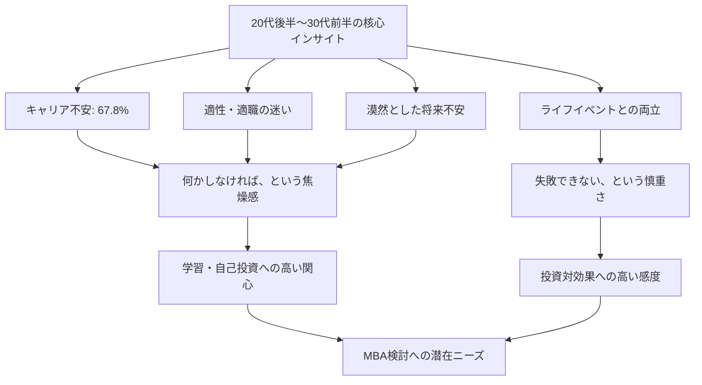
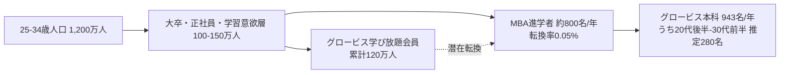
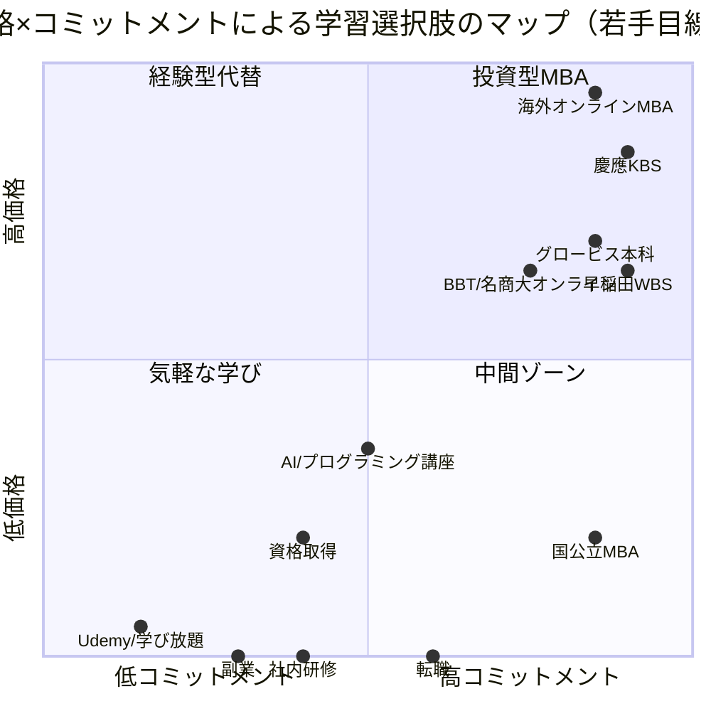

# 市場検証レポート：20代後半〜30代前半向けMBA市場

**作成日:** 2026-05-28
**対象:** グロービス経営大学院 若手層（20代後半〜30代前半）学生募集

## エグゼクティブサマリー

国内MBA市場は年間入学者ベースで約2,000名前後と限定的だが、政府の「5年1兆円」リスキリング投資・eラーニング市場4,000億円規模への拡大を追い風に、社会人学習市場は全体として上向きである。一方、グロービス経営大学院の入学者は35歳以上が70%超を占め、23〜34歳層は28.7%にとどまる。20代後半〜30代前半は「クォーターライフクライシス」と呼ばれる漠然としたキャリア不安を抱える層（リクルート調査で20代の67.8%が不安あり）であり、潜在ニーズは大きいが、約350万円という学費と「年上だらけの教室で浮く」心理的障壁が獲得を阻んでいる。一方、競合の中で「学び放題→単科→本科」と段階的に体験できる導線、35,000名超の卒業生ネットワーク、ケースメソッド型の実践志向は、この層特有の「失敗したくない／投資対効果が読めない」不安に対する唯一無二の回答となり得る。

## 1. ターゲット課題の検証

### 1.1 20代後半〜30代前半のキャリア・学習ニーズの実態

この層は「クォーターライフクライシス」と呼ばれる、キャリア中期に向かう転換期の漠然とした不安を抱える世代である。具体的には以下の特徴がある。

| 項目 | 内容 | 出典 |
|------|------|------|
| キャリア不安を抱える割合 | 20代の67.8%が「今後のキャリアに不安あり」 | リクルート2022年キャリア意識調査 |
| 20代の主な悩み | 適性・適職が分からない、労働環境の不満 | 株式会社ミズカラ調査 |
| 30代男性の1位 | 将来のキャリアに関する漠然とした不安 | 株式会社ACIL調査 |
| 30代女性の1位 | 仕事と結婚・育児・家庭の両立 | 株式会社ACIL調査 |
| 平均年収（25〜29歳） | 407万円（国税庁令和6年分） | 国税庁民間給与実態統計 |
| 中央値（20代後半・大卒） | 352.8万円 | doda平均年収ランキング |

社会背景として、終身雇用の崩壊、転職の一般化、リモートワークによる働き方の多様化により、「自ら考えてキャリアを設計しなければならない」プレッシャーが強まっている。同時に、結婚・育児という大きなライフイベントとキャリア投資のタイミングが重なるため、判断の難易度が極めて高い。

### 1.2 MBA進学の典型的障壁

**費用面**

- 国内MBAの学費レンジは100〜430万円。グロービスは2年間で約345万円（教育訓練給付活用で実質約217万円）
- 国公立（一橋等）は150万円程度と私立の半額以下で、若年層には選択肢として強い
- 海外フルタイムは800〜2,000万円。さらに2年間の年収機会損失（800〜1,000万円相当）が乗る

**時間面**

- フルタイム通学は事実上選択不可。社会人は夜間・週末通学かオンラインに集中
- 仕事との両立で「2年間プライベートが消える」覚悟が必要
- 20代後半〜30代前半は仕事の責任が増す時期と重なり、時間捻出が最も困難な世代

**心理面**

- 「20代でMBAは早すぎるのでは」という不安（実務経験の浅さへのコンプレックス）
- 「クラスメイトが年上ばかりで浮かないか」という懸念。実際、グロービスの体験談でも「20代は1クラスに2〜3人」「最年少になりがち」との声
- 投資対効果（ROI）への不安。年収400万円台の層にとって350万円は年収相当の投資

### 1.3 SNS・体験談からの定性的シグナル

- グロービス経営大学院体験者の声：「20代は1回の授業に2〜3人くらい、26〜30歳で通うとクラスの最年少になることもしばしば」（[JAMEEES BLOG](https://www.jameeesblog.com/mba-globis-briefing/)、[note・杉原](https://note.com/sugihara_/n/n4b99ddd22f1b)）
- 27歳でMBA入学した営業職女性：「クラスの40代・50代の方々から『若いからこその意見で面白い』と捉えてもらえた」（[BBT大学院](https://www.ohmae.ac.jp/taikendan_tounohikaru/)）
- 「29歳でMBAを取得、キャリアの可能性が無限に広がった」体験談も（[BBT大学院](https://www.ohmae.ac.jp/taikendan_tounohikaru/)）

ポジティブ体験談は存在するが、「年齢的アウェイ感」を裏返した語り口が多く、若手にとっての心理的ハードルの高さを暗示する。

## 2. 市場規模の推定

### 2.1 国内MBA市場規模

| 指標 | 数値 | 出典 |
|------|------|------|
| 国内MBA志願者数 | 2003年1,184人→2006年2,736人と急増 | 文部科学省／グロービス概況 |
| 国内ビジネススクール入学者数 | 2010〜2017年は年間約2,000人前後で推移、7年で23%増 | 文部科学省 |
| 40代以上の構成比 | 全体の約10% | START X調査 |
| グロービス日本語MBA入学者（2025年度） | 943名（過去最多） | グロービス公式 |
| グロービス英語MBA入学者（2025年度） | 39カ国141名（過去最多） | グロービス公式 |
| グロービス累計卒業生 | 日英累計1万人超（2024年度時点） | グロービス公式 |

国内MBA市場全体（年間入学者）は推定2,500〜3,000名規模と見られ、うちグロービスが約3〜4割を占める寡占的ポジションにある。一方、20代後半〜30代前半のセグメントは、グロービスの23〜34歳層構成比（28.7%）を全体に当てはめると年間約700〜850名にとどまる。市場拡大の余地は若手層の取り込みにこそ存在する。

### 2.2 社会人学習市場全体のトレンド

国内MBA市場は限定的だが、その「裾野」となる社会人学習市場は明確な拡大基調にある。

| 市場 | 規模 | 出典 |
|------|------|------|
| eラーニング市場（2025年度予測） | 3,849億円（前年比1.0%増） | 矢野経済研究所 |
| 社会人教育市場（2022〜2023年度） | 約3,200億円 | 各種推計 |
| 政府リスキリング支援 | 5年で1兆円規模 | 経済産業省・首相所信表明（2022年10月） |
| 個人でリスキリング実施中 | 34%（2023年10月時点） | SOKKIN調査 |
| グロービス学び放題会員数 | 累計120万人超（2025年4月時点） | グロービス公式 |

### 2.3 20代後半〜30代前半セグメントの規模感

- 日本の25〜34歳人口は約1,200万人（総務省人口推計ベース）
- うち大卒・正社員・年収400万円以上で「学習・自己投資意欲が高い」層をMBA潜在ターゲットと仮定すると約100〜150万人
- 現状のMBA進学者は年間800名前後（推定）にすぎず、潜在転換率は0.05〜0.08%程度
- 一方、グロービス学び放題には120万人超が在籍しており、ここから本科進学への転換は本質的な未開拓フロンティア

## 3. 主要競合・代替手段の調査

### 3.1 直接競合（国内MBA）

| 校名 | 学費（2年間） | 期間・形式 | 倍率 | 若手向け訴求 | 出典 |
|------|---------------|------------|------|--------------|------|
| グロービス | 約345万円（給付金後217万円） | 2年・夜間/オンライン全国5校舎 | 非公開（実質倍率は1倍台と見られる） | 学び放題からの導線、単科生制度（1科目17万円） | [グロービス公式](https://mba.globis.ac.jp/admissions/entry/expences.html) |
| 早稲田WBS | 約300万円超 | 全日制／夜間主 | 例年3倍超、2025年夜間主総合4.7倍 | 高ブランド・人脈志向、英語コース | [agaroot](https://www.agaroot.jp/domestic_mba/column/waseda/) |
| 一橋ICS／HUB | 約157万円 | 全日制／夜間 | 3〜4倍 | 圧倒的コスパ、研究志向 | [agaroot](https://www.agaroot.jp/domestic_mba/column/hitotsubashi/) |
| 慶應KBS | 約433万円 | 全日制中心、EMBAは別 | 2.49倍（2025年度） | 強固な卒業生ネットワーク | [agaroot](https://www.agaroot.jp/domestic_mba/column/keio/) |
| 名古屋商科大学 | 約330万円 | 週末／オンライン | 中程度 | AACSB等の国際認証、オンライン対応 | [名商大公式](https://mba.nucba.ac.jp/about-mba/onlinemba.html) |
| BBT大学院 | 約335万円 | 完全オンライン | 中程度 | 24時間オンデマンド、大前研一ブランド | [BBT公式](https://www.ohmae.ac.jp/tuition/) |
| 事業構想大学院 | 約290万円 | 夜間 | 非公開 | 起業・新規事業に特化 | 公式 |
| 神戸・筑波・他国公立 | 100〜150万円 | 夜間中心 | 中程度 | 圧倒的低価格 | [agaroot](https://www.agaroot.jp/domestic_mba/column/tuition/) |
| 海外オンラインMBA（IE等） | 500〜1,360万円 | 1〜2年・オンライン | 非公開 | グローバルブランド、英語環境 | [agaroot](https://www.agaroot.jp/abroad_mba/column/online/) |

### 3.2 代替手段（非MBA選択肢）

| 選択肢 | 価格目安 | 所要時間 | 提供価値 | 若手への訴求 | 出典 |
|--------|----------|----------|----------|--------------|------|
| グロービス学び放題 | 月1,650円〜 | 自由（動画7〜10分中心） | ビジネス基礎の体系理解 | 累計120万人、本科導線あり | [グロービス](https://hodai.globis.co.jp/) |
| Udemy | 1講座1,500〜2,500円（セール時） | 1講座2〜5時間 | 実務スキル即習得 | 21万コース、世界5,000万人 | [Udemy](https://www.udemy.com/) |
| Schoo | 月980円（録画視聴） | ライブ＋オンデマンド | 双方向ライブ学習 | コミュニティ性 | [Schoo](https://schoo.jp/) |
| 転職（事業会社・コンサル） | 0円〜（むしろ収入増） | 即時 | キャリアチェンジ、年収UP | 最も即効性のある代替 | dodaほか |
| 社内研修・選抜プログラム | 0円（会社負担） | 業務内 | 体系学習＋人脈 | 出費ゼロでMBAライト体験 | 各社 |
| 副業・複業 | 0円〜 | 自由 | 実践経験そのものを獲得 | 失敗してもダウンサイド小 | — |
| AI／プログラミング講座 | 30〜80万円 | 3〜6カ月 | 実装スキル、転職市場価値 | DX人材需要に直結 | TechAcademy、DMM等 |
| 中小企業診断士・USCPA等資格 | 20〜100万円 | 1〜3年 | 体系知識＋資格名刺 | 独学可能、コスパ良 | 各種予備校 |
| MOOC（Coursera等） | 月数千円〜 | 自由 | 海外大学講義、英語環境 | グローバル感、低価格 | Coursera |

### 3.3 ポジショニングマップ（若手視点）

## 4. グロービスの差別化ポイント（20代後半〜30代前半向け3軸）

### 軸1：段階的アクセス導線（学び放題→単科→本科）の独自性

**仮説：** 失敗に敏感な若手にとって「いきなり350万円のコミット」は最大の障壁。グロービスは月1,650円の学び放題（120万人会員）→1科目17万円の単科生（本科出願者の約9割が経験）→本科という階段を持つ唯一のMBAであり、この層の「お試しから入りたい」心理に完全に適合する。

**なぜこの層に響くか：**
- 20代の67.8%が抱えるキャリア不安は「行動したいが何が正解か分からない」状態。試行錯誤コストを最小化できる導線はこの心理を直撃する
- 単科で学費の一部を「先払いの実弾投資」として実体験できる。早稲田・慶應・一橋には類似の入口がなく、ROIが体感的にしか測れない
- 年収400万円台の層にとって、月1,650円〜17万円の試運転は意思決定の合理性を担保する

**根拠出典：** [グロービス出願者の約9割が単科講座経験者](https://www.agaroot.jp/domestic_mba/column/grobis/)、[学び放題累計120万人](https://globis.co.jp/news/mba/)

### 軸2：ケースメソッド×現役実務家講師による「実践即活用」体験

**仮説：** 若手が抱える「実務経験が浅いから学んでも活かせないのでは」という不安に対し、グロービスのケースメソッドは「明日の会議で使える思考フレーム」を即提供する。研究志向の強い国公立系MBA（一橋等）や講義型のオンラインMBA（BBT等）との差別化軸。

**なぜこの層に響くか：**
- 20代後半は「適性・適職が分からない」層。抽象的な経営理論より、具体的なケースを通じて「自分の現場をメタ認知する」学びが刺さる
- 講師の多くが現役経営者・コンサルタント。年上の実務家と対等に議論する場が、年下クラスメイトの「年齢的アウェイ感」を逆に「貴重な機会」へ反転させる
- 「学んだ翌週に成果が出る」という即効性は、結果を急ぐ若手のキャリア焦燥を満たす

**根拠出典：** [グロービス経営大学院 創造と変革のMBA](https://mba.globis.ac.jp/)、[実務直結カリキュラム評価](https://totonoesan.com/globis-mba/)

### 軸3：日本最大級の卒業生・在校生ネットワーク（1.2万人超）

**仮説：** 20代後半〜30代前半は「人脈は欲しいが、自分から開拓する自信はない」層。グロービスの累計1万人超の卒業生ネットワークと、5校舎＋オンラインで毎年900名超が入学する規模は、人脈形成の「歩留まり」が他校と桁違い。

**なぜこの層に響くか：**
- ライフイベント前の最後のタイミングで、業界を超えた同志を獲得できる「最後のチャンス」と訴求できる
- 早稲田・慶應・一橋は校舎単一・少人数で凝集性は高いが絶対数は小さい。グロービスは複数校舎・複数業界・複数年次の網目状ネットワークで、転職・副業・起業のいずれの選択肢でも繋がりが活きる
- 卒業生コミュニティが社会人クラブ的に機能しており、「学位取得後の人生」を可視化できる安心感がある

**根拠出典：** [グロービス2024年度日本語MBA卒業生 1,022名、日英累計1万人突破](https://globis.co.jp/news/mba/11424-2025-05-12/)、[2025年度入学者943名（過去最多）](https://globis.co.jp/news/mba/11217-2025-04-01/)

## 5. 戦略的示唆（次フェーズへの引き継ぎ）

本市場検証から、若手層獲得に向けた次フェーズの戦略設計で扱うべき論点は以下に集約される。

1. **「段階的アクセス導線」を若手向けに最適化できているか**：学び放題会員120万人のうち、20代後半〜30代前半の本科転換率は何%か。導線設計が35歳以上向けに偏っていないか
2. **「年齢的アウェイ感」をどう反転させるか**：20代限定の体験クラス・若手限定セッション・若手卒業生メンター制度等、心理障壁を解く打ち手の有無
3. **競合「価格訴求」の国公立系・「ブランド訴求」の早慶・「気軽さ訴求」の代替手段に対し、どこに陣を張るか**：価格でもブランドでもないグロービス独自の中央軸（実践×人脈×段階性）をどう尖らせるか
4. **「失敗できない」世代に対するROI可視化**：年収400万円台の若手に向けた具体的なキャリア成果データ（卒業後年収伸び、転職成功率、起業率等）の整備と訴求

これらの論点を次の戦略設計フェーズで深掘りする。

## 出典一覧

### ターゲット課題関連
- [マイナビキャリアリサーチLab「クォーターライフクライシス」](https://career-research.mynavi.jp/column/20240913_85662/)
- [株式会社ミズカラ 20代のキャリア悩み調査](https://mizukara.com/magazine/research/20s_survey/)
- [株式会社ミズカラ 30代のキャリア悩み調査](https://mizukara.com/magazine/research/30s_career/)
- [株式会社ACIL 30代キャリア悩みプレスリリース](https://prtimes.jp/main/html/rd/p/000000004.000103533.html)
- [エン・ジャパン 社会人4500人キャリアプラン調査](https://corp.en-japan.com/newsrelease/2024/36541.html)
- [doda 年収中央値（年齢別）](https://doda.jp/guide/heikin/median/)
- [JAC Recruitment 2025年平均年収](https://www.jac-recruitment.jp/market/knowhow/annual-income/average-annual-income/)

### MBA進学障壁関連
- [グロービス経営大学院 学費・教育訓練給付金](https://mba.globis.ac.jp/admissions/entry/expences.html)
- [agaroot MBA費用](https://www.agaroot.jp/domestic_mba/column/tuition/)
- [アビタス 国内MBA費用](https://www.abitus.co.jp/column_voice/mba/column_voice22.html)
- [START X 時間がない社会人とMBA](https://startx.jp/premba/mba/mba-advantage/)
- [グロービス20代・30代でMBA](https://mba.globis.ac.jp/knowledge/detail-24515.html)
- [東洋経済オンライン 20代・30代になぜMBA](https://toyokeizai.net/articles/-/63625)
- [BBT大学院 29歳でMBA体験談](https://www.ohmae.ac.jp/taikendan_tounohikaru/)
- [JAMEEES BLOG グロービス体験クラス](https://www.jameeesblog.com/mba-globis-briefing/)
- [note 杉原 グロービス3年半体験](https://note.com/sugihara_/n/n4b99ddd22f1b)

### 市場規模関連
- [グロービス 国内MBA概況](https://mba.globis.ac.jp/about_mba/overview.html)
- [アビタス MBAホルダー人数](https://www.abitus.co.jp/column_voice/mba/column_voice61.html)
- [矢野経済研究所 eラーニング市場2025](https://www.yano.co.jp/press-release/show/press_id/3795)
- [スキルアップ研究所 リスキリング市場](https://reskill.gakken.jp/3247)
- [AI経営総合研究所 リスキリング市場規模](https://ai-keiei.shift-ai.co.jp/reskilling-market-size/)
- [スキルアップ研究所 5年1兆円リスキリング](https://reskill.gakken.jp/3245)
- [経済産業省 第四次産業革命スキル習得講座](https://www.meti.go.jp/policy/economy/jinzai/reskillprograms/index.html)
- [NIKKEIリスキリング 政府支援まとめ](https://reskill.nikkei.com/article/DGXZQOLM01B6G0R00C23A8000000/)

### 競合・代替手段関連
- [agaroot 早稲田WBS](https://www.agaroot.jp/domestic_mba/column/waseda/)
- [agaroot 慶應KBS](https://www.agaroot.jp/domestic_mba/column/keio/)
- [agaroot 一橋HUB](https://www.agaroot.jp/domestic_mba/column/hitotsubashi/)
- [agaroot 名古屋商科大学](https://www.agaroot.jp/domestic_mba/column/nucb/)
- [BBT大学院 学費](https://www.ohmae.ac.jp/tuition/)
- [名商大ビジネススクール オンラインMBA](https://mba.nucba.ac.jp/about-mba/onlinemba.html)
- [agaroot 海外オンラインMBA](https://www.agaroot.jp/abroad_mba/column/online/)
- [グッドスクール 海外MBAランキング2026](https://gooschool.jp/online/mba-ranking-overseas/)
- [Learning Hub Udemy vs グロービス学び放題](https://www.zenes.jp/udemy-vs-globis/)
- [マナカツ 社会人向け動画学習サービス比較](https://gooiridblog.com/comparison/)

### グロービス公式
- [グロービス 2025年度日本語MBA入学（943名）](https://globis.co.jp/news/mba/11217-2025-04-01/)
- [グロービス 2024年度日本語MBA卒業（1,022名、累計1万人突破）](https://globis.co.jp/news/mba/11424-2025-05-12/)
- [グロービス 英語MBA 2025年度入学（39カ国141名）](https://globis.co.jp/news/mba/11834-2025-09-08/)
- [グロービス 学生プロファイル](https://mba.globis.ac.jp/alumni/profile/data.html)
- [グロービス 20代卒業生キャリアアンケート](https://mba.globis.ac.jp/feature/alumni/questionnaire/twenties.html)
- [グロービス 30代後半・40代でMBA](https://mba.globis.ac.jp/knowledge/detail-25212.html)
- [グロービス 卒業生キャリアアンケート（91.6%キャリアアップ）](https://prtimes.jp/main/html/rd/p/000000010.000052928.html)
