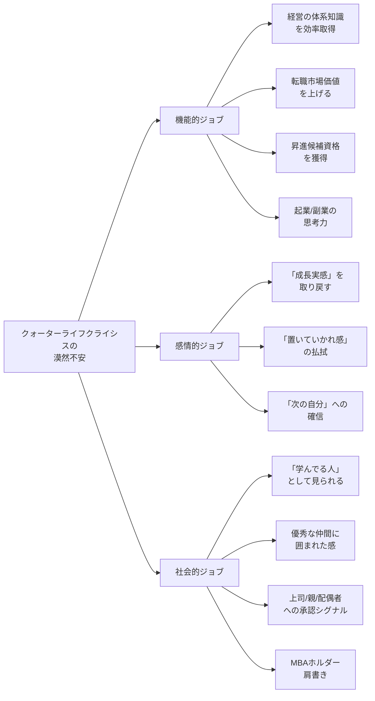
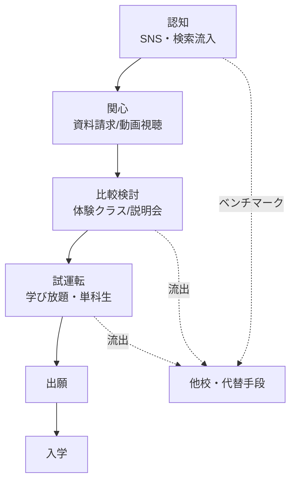
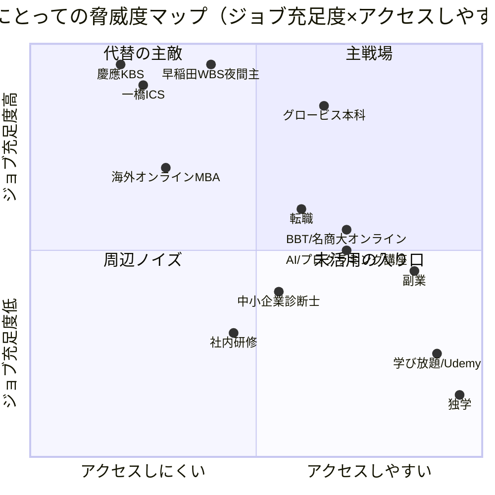
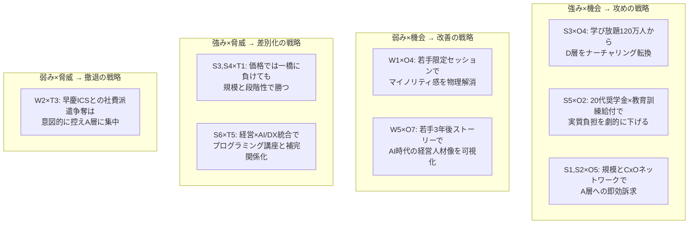

# 戦略設計：若手（20代後半〜30代前半）MBA募集

**作成日:** 2026-05-28
**前提資料:** [outputs/市場検証_若手MBA市場_20260528.md](市場検証_若手MBA市場_20260528.md)、[outputs/検証結果_市場検証_若手MBA市場_20260528_20260528.md](検証結果_市場検証_若手MBA市場_20260528_20260528.md)
**作成スタンス:** 熟練マーケティングコンサルタント（20年実務経験）として、フレームワーク網羅ではなく本質的論点に答える。「一般論として」「〜が重要です」は禁則。施策は数字・実行手順まで落とす。

## エグゼクティブサマリー

若手獲得の本質的論点は「グロービスは2026年度1,089名で過去最多入学を達成したが、そのうちどれだけが20代後半〜30代前半か」が公式に不明であり、グロービス自身が2026年2月に20代奨学金を新設した事実そのものが「現状の若手比率は経営課題」というシグナルである、という点に集約される（[グロービス公式PR 2026/2/20](https://globis.co.jp/news/mba/12525-2026-02-20/)）。本戦略は「上昇志向の事業会社中堅（A層）」を主戦場、「キャリア不安層（D層）」を学び放題120万人会員（[グロービス公式PR 2025/4/25](https://globis.co.jp/news/elearning/11342-2025-04-25/)）からの段階転換育成プールとする2層攻めを推奨する。中心となる差別化軸は「実践即活用（ケースメソッド）×段階アクセス（学び放題→単科→本科）×同世代コミュニティ（若手限定セッション）」の三位一体。7Pでは特に Price（20代奨学金20万円は弱く、初年度50%給付・最大128万円教育訓練給付込みで実質負担を年収50%以下に圧縮）、People（年上クラスメイト不安を「若手限定クラス／若手メンター」で物理的に解消）、Promotion（X・YouTube・noteで若手卒業生の3年後年収・キャリア変化ストーリーを定量公開）の3点を最重要レバーとして優先する。

## 1. 顧客インサイト分析（最重要）

### 1.1 MBA進学はどんな「ジョブ」を片付ける手段か

20代後半〜30代前半の社会人にとって、MBAは「学位を取る」という表層的な行為ではなく、複数のジョブを束ねて片付ける装置である。クレイトン・クリステンセンのJobs-to-be-Doneの観点で3層に分解する。

#### 機能的ジョブ（直接の課題解決）

| ジョブ | 検証可能な根拠 |
|--------|----------------|
| 経営の体系知識を効率的に取得したい | 20〜30代正社員332名のうち、希望実現のために必要なこと1位「専門スキル向上」50.4%（[グロービス公式PR 2024/11/26](https://globis.co.jp/news/elearning/10696-2024-11-26/)） |
| 転職市場での市場価値を上げたい | 同調査でキャリアアップを「年収UP」と定義する割合56.9%、5年以内の目標1位「給与UP」51.5% |
| 昇進・昇格に必要な実績を作りたい | 同調査3位「社内で高い実績を出すこと」37.1% |
| 起業・副業に必要な思考力 | マイナビ「年収UP手段」で副業23.4%が最多（[マイナビキャリアリサーチLab 2024/5/20](https://career-research.mynavi.jp/reserch/20240520_75161/)） |

#### 感情的ジョブ（自己との対話）

- 「クォーターライフクライシス」と呼ばれる、20代後半〜30代前半特有の漠然とした不安（マイナビ等が指摘）
- 「同期が転職した／副業で年収を抜かれた」相対比較による焦燥感
- 「このままの会社・このままの自分でいいのか」というメタ問い
- 「成長実感を取り戻したい」「もう一度学ぶ自分でありたい」というアイデンティティ欲求

#### 社会的ジョブ（他者からの承認・帰属）

- 「学んでる人」「成長志向の人」というラベルを獲得したい
- 優秀な同志に囲まれている所属感
- 上司・親・配偶者（パートナー）に対して説明可能な肩書き
- 転職時のレジュメ強化、結婚市場・住宅ローン審査での社会的記号

### 1.2 検討に至る心理的トリガー（具体）

「ある日急にMBAを考え始める」ことはまずない。下記いずれかの**実体験ショック**がトリガーになる。

1. **昇進候補からの落選または「将来選抜」からの除外感**：30歳前後で「次の課長候補」リストに自分の名前がないと知る
2. **同期の転職・年収逆転**：LinkedInやSNSで、同期がコンサル・PE・スタートアップへ転職して年収が大幅に上がるのを見る
3. **副業・複業の限界体験**：副業を始めたが「体系性のない我流」だと痛感
4. **マネジメント職登用後の壁**：プレイングマネジャーとして任命されたが、財務・組織論・戦略の言語を持たず行き詰まる
5. **ライフイベント前の最終投資窓**：結婚・出産・住宅購入を控え「自己投資できる最後の2年」と意識
6. **AI／DXによる職業不安**：自分の職務がAIに代替されるという外部ショック

### 1.3 ためらいの正体（決定の前で止まる理由）

ジョブが明確でも、約半数が「行動できない」と回答している（同グロービス調査で「行動中」51.8% ⇔ 残り48.2%が行動できていない）。その内訳：

| ためらいの種類 | 具体の内容 | 検証可能な根拠 |
|----------------|------------|----------------|
| 時間 | 仕事と勉強の両立可能性への不安 | 同調査で行動阻害理由1位「時間が確保できない」46.0% |
| 費用ROI | 「345万円を投じて回収できるか」「給付金活用しても実質217万円」 | グロービス2年総額3,450,000円、教育訓練給付最大128万円控除後実質約2,170,000円（[厚労省](https://www.mhlw.go.jp/stf/seisakunitsuite/bunya/koyou_roudou/jinzaikaihatsu/kyouiku.html)）。20代正社員年収中央値364.9万円に対し約60%相当 |
| 心理（年齢） | 「年上ばかりの教室で浮かないか」「実務経験が浅い自分が議論に貢献できるか」 | グロービスが2026/2/20に29歳以下対象「20代MBA進学応援奨学金」を新設した事実が、組織として若手の心理障壁を認識している証拠 |
| 承認 | 配偶者・親・上司・会社から反対される、または評価が下がる懸念 | 公式定量データはないが、若手卒業生発信の体験記で頻出 |
| 継続 | 2年間続けられる自信がない | 単科生制度で「試運転」できるが、若手はその存在自体を知らない可能性 |

### 1.4 決め手（「やる」と決まる瞬間）

- **体験クラスで「自分にも話せる／学べる」と実感**：抽象的な説明会ではなく、実際の議論に参加して自分の発言が拾われる経験
- **同世代卒業生の「具体的な3年後」ストーリー**：年収・役職・転職先など定量化された変化
- **信頼できる第三者からの後押し**：上司・卒業生・配偶者の「やれ」「応援する」の一言
- **単科生で1科目修了**：心理的・経済的に小さく試して「続けられる」と実証する経験
- **奨学金・教育訓練給付の組み合わせで「実質月額X万円」の具体額提示**：抽象的な総額ではなく月次のキャッシュフローへの分解

### 1.5 情報接触行動と意思決定プロセス

- 20代後半〜30代前半は、X（旧Twitter）・YouTube・note・LinkedIn・Instagramを主要接点とする。検索キーワードは「MBA 意味ない」「20代 MBA」「働きながら 大学院」「MBA 後悔」「グロービス 評判」など、**懐疑的な検索クエリが先行**するのが特徴
- 主要メディアは PIVOT、NewsPicks、東洋経済オンライン、ダイヤモンドオンライン
- グロービス側の重要事実：本科出願者の約9割は単科講座経験者（=「試運転後の出願」が標準フロー）（[国内MBAコラム agaroot](https://www.agaroot.jp/domestic_mba/column/grobis/) ※二次情報、要公式確認）

### 1.6 だから何の施策につながるのか

1. **「年上だらけ教室問題」を物理的に解消する**：20代限定の体験クラス／20代限定セッション（学期内1〜2回）／20代だけのオンライン勉強会の常設
2. **「具体的な3年後」のコンテンツ強化**：若手卒業生10〜20名を選定し、入学前年収・卒業3年後年収・キャリア変化を定量化した動画／note記事を月1本ペースで継続発信
3. **単科生制度の20代向け再パッケージ**：「20代お試しトラック」として、1科目目を50%オフ（実質8.5万円）にする時限プロモを試行
4. **AI／DX不安というトリガーを起点としたコンテンツ設計**：「AI時代の経営人材」というメッセージで、若手特有の職業不安に直接訴える
5. **意思決定プロセスの長さを前提とした6カ月リードナーチャリング**：学び放題→単科→本科の標準フロー上で、若手限定の毎月接触ポイント（メルマガ／ウェビナー／コミュニティ）を設計

## 2. 競合・代替手段分析（同じジョブを片付ける選択肢として並べる）

直接競合（他大MBA）だけを比較しても若手獲得戦略は描けない。20代後半〜30代前半の「キャリア中期の成長投資」というジョブを片付ける選択肢全体を並べる。

### 2.1 ジョブ別の選択肢マップ

「経営知識の体系取得」「キャリア市場価値UP」「同志ネットワーク獲得」「自己投資の社会的記号」の4ジョブごとに、選択肢の強み・弱みを並べる。

| 選択肢 | 経営知識取得 | 市場価値UP | 同志ネット | 社会的記号 | 価格 | 所要時間 | 主な弱み |
|--------|--------------|------------|------------|------------|------|----------|----------|
| **グロービス本科** | ◎ | ○ | ◎ | ○ | 345万円（給付後217万円） | 2年・夜間/オンライン | 学生平均年齢が高めとされる（一次データ未確認）、Tier 1ブランドではない |
| **早稲田WBS夜間主** | ◎ | ◎ | ◎ | ◎ | 380万円 | 2年・夜間 | 募集人員150名で倍率3〜5倍、社費派遣中心で20代少数 |
| **一橋ICS／HUB** | ◎ | ◎ | ○ | ◎ | ICS:157万円(2年制) / HUB:不明 | ICS:1年or2年・全日制 / HUB:2年・夜間 | ICSは英語フルタイムで仕事との両立困難、HUBは少数精鋭で倍率高 |
| **慶應KBS** | ◎ | ◎ | ◎ | ◎ | 不明（公式未確認） | 全日制中心 | 全日制中心で社会人継続困難 |
| **BBT大学院** | ○ | ○ | △ | △ | 不明 | 2年・完全オンライン | ネットワーク薄く社会的記号弱い |
| **名古屋商科大学** | ○ | ○ | ○ | ○ | 不明 | 週末/オンライン | 関東圏での認知低い |
| **海外オンラインMBA（IE等）** | ○ | ◎（外資/グローバル志向） | ○ | ◎ | 500〜1,360万円 | 1〜2年・オンライン | 英語必須、価格高 |
| **転職（事業会社→コンサル等）** | △（実務経由） | ◎（即時年収UP） | △ | ○ | 0円（むしろ収入増） | 即時 | 経営の体系学習にはならない、入社後激務 |
| **社内研修・選抜プログラム** | ○ | △（社内のみ） | △ | △ | 0円（会社負担） | 業務内 | 出費ゼロだが転職市場での記号性なし |
| **副業／複業** | △ | ◎（実践経験） | ○ | △ | 0円〜 | 自由 | 体系性なし、断片化リスク |
| **AI／プログラミング講座** | △ | ◎（DX人材需要に直結） | △ | △ | 30〜80万円 | 3〜6カ月 | 「経営」のジョブには直接答えていない |
| **中小企業診断士／USCPA等資格** | ○ | ○ | △ | ○ | 20〜100万円 | 1〜3年 | 同志ネットワーク弱い、独学中心 |
| **グロービス学び放題／Udemy／Schoo** | △〜○ | △ | × | × | 月数百〜数千円 | 自由 | 単独では「ジョブ」を片付けるには不十分 |
| **独学（書籍・ポッドキャスト）** | △ | × | × | × | 0〜5万円 | 自由 | 認証性ゼロ、継続困難 |

### 2.2 真の競合は誰か（脅威度マッピング）

**第一の脅威：** 早稲田WBS夜間主・慶應KBS・一橋HUB（いずれもブランド優位だが入りにくい・社費派遣中心）
**第二の脅威：** 転職（最も即効性が高いジョブ充足手段）
**第三の脅威：** 副業・AI/プログラミング講座（特に「市場価値UP」ジョブに対する代替性が高い）

### 2.3 だから何の施策につながるのか

1. **「他大MBAとの比較」だけでなく「転職／副業との比較」を正面から扱うコンテンツが必要**：「転職してから学ぶ vs 学んでから転職する」の損益分岐を可視化した比較記事／動画を公開
2. **海外オンラインMBA（IE・Quantic）との価格＋時間比較**：500万円＋英語2年 vs グロービス217万円＋日本語2年で「日本市場で勝ちに行く20代」というポジションを明示
3. **AI／プログラミング講座を補完財として扱う**：「経営×AIリテラシー」という組み合わせメッセージで、両者を排他的選択ではなく組み合わせとして提案
4. **早稲田・慶應・一橋にない「気軽に試せる」価値**：単科生制度／学び放題のリードナーチャリングが最大の構造的優位。これを若手向けに前面に出す

## 3. STP分析

### 3.1 Segmentation：意味のある軸での細分化

20代後半〜30代前半を年齢だけで切らない。動機の強さ×リソース×キャリアタイプで6セグメントに分解する。

| ID | セグメント名 | 年齢 | 年収 | 業種・職種 | 動機の強さ | リソース | 推定規模感 |
|----|--------------|------|------|------------|------------|----------|-----------|
| A | 上昇志向の事業会社中堅 | 28-32 | 500-800万 | コンサル／メーカー・商社・金融大手の中堅／IT大手 | ★★★（明確な野心） | ★★★（自己負担可、上司の理解あり） | 中 |
| B | 専門職キャリア展開層 | 28-34 | 600-1,200万 | エンジニア／医師／弁護士／会計士／コンサル | ★★（専門×経営の補完） | ★★★ | 中 |
| C | 起業準備層 | 28-34 | 400-700万 | 副業既にあり／元起業／スタートアップ社員 | ★★★ | ★★（時間優先） | 小 |
| D | キャリア不安層 | 25-30 | 300-450万 | 中小企業／非主力部署／第二新卒からの中途入社 | ★（漠然とした焦り） | ★（負担キツい） | **大** |
| E | 育休前後の女性層 | 28-34 | 350-700万 | 全業種 | ★★（ライフイベント前の自己投資窓） | ★（時間制約） | 中 |
| F | 大企業の研修派遣候補層 | 28-33 | 500-900万 | 大手企業の幹部候補 | ★（会社命令） | ★★★（会社負担） | 小 |

### 3.2 Targeting：最も獲得すべきサブセグメント

**第一ターゲット（主戦場）：A 上昇志向の事業会社中堅**
- 理由①：動機が明確で意思決定までのリードタイムが短い（6〜12カ月）。コンバージョン効率が高い
- 理由②：年収500-800万円のため、教育訓練給付（最大128万円）控除後の実質負担217万円が現実的に支払い可能
- 理由③：卒業後のキャリアアップ事例化に最も成功しやすく、ストーリーマーケのコンテンツ源泉になる
- 理由④：他校（早稲田・慶應）との直接競合になるが、グロービスの「夜間／オンライン全国5校舎＋オンライン」「年間1,089名規模」（[グロービス公式PR 2026/4/1](https://globis.co.jp/news/mba/12831-2026-04-01/)）でアクセシビリティ優位

**第二ターゲット（育成プール）：D キャリア不安層**
- 理由①：マーケットボリュームが圧倒的に大きい（マイナビ「20代正社員意識調査2024」で20代正社員のリスキリング経験率16.3%＝83.7%は未着手）（[マイナビキャリアリサーチLab 2024/5/20](https://career-research.mynavi.jp/reserch/20240520_75161/)）
- 理由②：学び放題120万人会員（[グロービス公式PR 2025/4/25](https://globis.co.jp/news/elearning/11342-2025-04-25/)）の中に大量に潜在する。本科への転換率が1%でも12,000人＝現状の本科入学者の10倍以上
- 理由③：即時転換は難しいが、12〜24カ月のナーチャリングで本科へ動かす設計が可能

**第三ターゲット（差別化補完）：E 育休前後の女性層**
- 業界全体で若手女性MBAの絶対数が少なく、戦略的価値が高い（ダイバーシティ訴求、企業の女性活躍指標）

**意図的に外す層：F 大企業の研修派遣候補層**
- 早稲田WBS・慶應KBSが社費派遣のメイン受け皿。グロービスがここに正面で挑むのは資源効率が悪い

### 3.3 Positioning：A層・D層に対する提供価値の言語化

**A層（上昇志向の事業会社中堅）へのポジショニング・ステートメント：**

> 「**働きながら、20代から、本気で経営を学ぶ、日本最大のコミュニティ。**実践即活用のケースメソッドで、明日の仕事から成果が出る。CxO経験者2,061名を含む14,000人超の同窓ネットワークが、卒業後も10年・20年あなたを押し上げる。」

**D層（キャリア不安層）へのポジショニング・ステートメント：**

> 「**月1,650円から、いつでもやめられる。**でも、続けたら人生が変わった人が、ここに14,000人いる。学び放題→単科→本科。あなたのペースで、自分の限界線を更新していい。」

### 3.4 だから何の施策につながるのか

1. **A層・D層で広告・コンテンツを完全分離**：A層には「キャリアアップROI」と「卒業生年収UP実績」、D層には「気軽に始められる」「やめても損しない」を訴求する別軸キャンペーンを設計
2. **A層向け：転職経験豊富な28-32歳に絞ったLinkedIn広告（年収500万円以上フィルター）／PIVOT・NewsPicksのスポンサーコンテンツ**
3. **D層向け：学び放題会員へのライフサイクルメール（6カ月・12カ月・18カ月在籍者で別カスタマージャーニー）／単科生制度の20代限定ディスカウント**
4. **E層向け：女性卒業生コミュニティ「Globis Women Network」（仮）の創設、育休復帰後の単科生プログラム**
5. **F層は意図的に取りに行かない**：早慶ICSとの不毛な社費派遣争奪戦は資源効率が悪い。むしろB to B側で「経営者教育」のテーマに集中投資

## 4. マーケティングミックス（7P）の設計

教育サービスは無形商材であり、Product・Price・Place・Promotionだけでは設計不能。People（教える人・学ぶ仲間）、Process（出願〜卒業の体験）、Physical Evidence（信頼の物理的証拠）を含めた7Pで設計する。

**特に若手獲得の観点で見直しが必要な順序：People ＞ Price ＞ Promotion ＞ Process ＞ Product ＞ Physical Evidence ＞ Place**

### 4.1 Product（プログラム設計）

**現状：** テクノベートMBA（日本語）、エグゼクティブMBA（日本語）、英語MBAの3系統。20代奨学金は前2者対象（[グロービス公式PR 2026/2/20](https://globis.co.jp/news/mba/12525-2026-02-20/)）。

**若手向け強化案：**
- **若手限定セレクティブ科目**：20代の関心が高いテーマ（AI戦略、スタートアップファイナンス、副業の事業化、海外展開）を組み合わせた「若手キャリアトラック」を本科内に設計
- **20代キャップストーン（卒業プロジェクト）**：年上クラスメイトとは別に、20代だけのチームでスタートアップ・新規事業立案を行うトラック
- **入学前プレ講座（パワーアップ研修）**：実務経験浅い20代の心理障壁を解消する「事前準備講座」を本科入学2カ月前に必修化

### 4.2 Price（価格戦略）— **最重要レバー**

**現状：** 2年総額3,450,000円。教育訓練給付最大128万円控除後実質約2,170,000円。20代奨学金は給付型20万円（2年合計、2027年4月入学から）。

**問題点：** 20代奨学金20万円は2年総額3,450,000円に対して**わずか5.8%**の負担軽減に過ぎず、A層の意思決定を覆すには不十分。D層には全く届かない。

**若手向け価格戦略：**

| 施策 | 内容 | 期待効果 |
|------|------|---------|
| 20代特別給付の拡充 | 29歳以下入学者に「初年度授業料の25%（=約43万円）」を給付型で支給。現行の20万円と差し替え | 教育訓練給付128万円＋25%給付43万円＝171万円控除で実質約174万円（年収500万円層には約35%相当） |
| 卒業後3年で年収UP連動の奨学金 | 卒業3年以内に年収20%以上UPで、入学金80,000円を全額返還 | 「ROI不安」への直接の回答。グロービス側もコミット |
| 単科生「20代お試し1科目目」 | 1科目目を50%オフ（実質8.5万円） | 試運転コスト最小化、出願者の9割が単科生という導線を強化 |
| 育休前後の女性向け延長プラン | 最大4年で修了可能、育休期間は授業料50%免除 | E層への正面訴求 |

**前提条件と注意：** 上記の給付額・条件はあくまで戦略仮説。実装には2027年度予算（推定3-5億円規模の追加投資）と理事会承認が必要。

### 4.3 Place（受講形態・チャネル）

**現状：** 国内本科4校舎（東京・大阪・名古屋・福岡）、特設3校舎（仙台・水戸・横浜）、オンライン。

**若手向け強化：**
- **オンライン中心の「20代トラック」**：通学なしで完結する選択肢を明示（仕事の繁忙・転勤への耐性）
- **海外拠点（シンガポール・バンコク等）の20代向け招聘**：海外駐在中の若手日本人向けに、現地拠点での体験クラスを月1回開催
- **コワーキングスペース（WeWork等）でのサテライト学習スペース**：通学キャンパスがない地方都市でも「グループワークだけ」できる場所を提供

### 4.4 Promotion（プロモーション戦略）

**現状：** 公式サイト、説明会、PRリリース、社費派遣ルート。若手向けの専用施策の有無は不明。

**若手向け最重要施策：**
- **若手卒業生10〜20名の「3年後ストーリー」コンテンツ化**：入学前年収・卒業3年後年収・転職有無・役職変化を**定量的に**公開する動画／note記事を、X／YouTube／Instagramで月1本ペースで発信
- **「20代でMBAを取った人」専用ランディングページ**：現状の公式サイトは全年代向け。20代向けに完全分離したLPで、メッセージ・ビジュアル・FAQをすべて若手仕様に再構築
- **PIVOT・NewsPicksでのスポンサードコンテンツ**：20代後半が最も触れるビジネスメディアでの定期出稿
- **LinkedIn広告のターゲティング強化**：年収500万円以上、業種コンサル／メーカー大手／IT、年齢28-32歳に絞り込み
- **「年上ばかりで浮かないか」への正面回答コンテンツ**：実際の20代在学生・卒業生に「最年少だったが、年上クラスメイトと議論することで得られたもの」を語ってもらう動画
- **AI時代の経営人材というメッセージ軸**：AI／DXによる職業不安をトリガーに、「AI×経営」という統合メッセージで他校・他講座と差別化

### 4.5 People（講師・クラスメイト・職員）— **第二の最重要レバー**

**現状：** 講師の多くが現役経営者・コンサルタント。クラスメイトは多様な業種職種で構成されているが、平均年齢は高い（公式の年齢構成データは未公開）。

**若手向け強化：**
- **若手卒業生メンター制度（必修）**：入学時に29歳以下の在校生・卒業生を1名ずつメンターとしてアサイン。月1回30分のオンライン1on1
- **20代限定クラスチーム**：グループワーク科目の一部で、20代だけで構成されたチームを意図的に組成
- **女性比率の可視化と引き上げ目標**：E層獲得の前提として、現状の女性比率を公開し、毎年+2ポイント等の目標設定
- **入学事務職員に「20代担当」を専任配置**：出願・在学・卒業後すべての接点で「同年代の伴走者」を配置

### 4.6 Process（出願〜学習〜卒業のプロセス体験）

**現状：** 出願者の約9割が単科生経験者（[国内MBAコラム agaroot](https://www.agaroot.jp/domestic_mba/column/grobis/) ※二次情報、要公式確認）。学び放題→単科生→本科の段階導線あり。

**若手向け強化：**
- **「20代お試しジャーニー」の明確化**：学び放題3カ月無料 → 単科生1科目50%オフ → 本科出願前の若手限定説明会 → 出願 → 入学のステップを公式LPで明示
- **出願前カウンセリング強化**：20代の出願検討者全員に対し、若手卒業生による1時間のキャリア相談を無料提供
- **本科入学時のオンボーディング再設計**：入学直後2週間で、20代だけの「同期キックオフ」「年上クラスメイトとの議論シミュレーション」を組み込む
- **卒業後3年のフォロー強化**：A層がROIを検証できる時期に合わせて、3年後の年収・キャリア変化を本人と双方向でトラッキング

### 4.7 Physical Evidence（信頼の物理的証拠）

**現状：** 累計卒業生1万人超、在校生・卒業生14,000人超、CxO経験者2,061名（[グロービス公式PR 2026/4/1](https://globis.co.jp/news/mba/12831-2026-04-01/)）、2026年度入学者1,089名（過去最多）。

**若手向け強化：**
- **「若手の卒業3年後の変化」を数字で公開**：年収中央値の変化、転職率、起業率、役職昇進率を年齢別に開示
- **CxO経験者2,061名のうち、入学時28-32歳だった人の絶対数**を公開（10人？100人？1,000人？の規模感が決定的に重要）
- **若手卒業生インタビューを校舎ロビーや公式サイトに常設**：訪問者が若手のロールモデルに必ず触れる動線設計
- **20代の入学者構成（業種・職種・出身大学）を毎年公開**：「自分と似た背景の人が入学している」という安心感

### 4.8 だから何の施策につながるのか（7P統合）

優先度順の3つの実行アクション：

1. **【Q3-2026までに着手】20代給付奨学金の拡充検討と理事会承認獲得**：現行20万円→初年度授業料25%給付に増額。教育訓練給付と組み合わせ「実質負担を年収50%以下」を訴求できる構造を作る
2. **【Q4-2026までに公開】若手卒業生10名の3年後ストーリー定量コンテンツ**：X／YouTube／note／LinkedInで同時展開。月1本ペースで継続発信開始
3. **【2027年4月入学者向けに完成】20代お試しジャーニーの公式LP**：学び放題から本科までの導線を若手仕様に完全分離。出願前カウンセリング・若手限定説明会・若手メンター制度をパッケージ化

## 5. SWOT分析（補助的位置づけ）

上記1〜4の結論を整理する目的でのSWOT。機会・脅威はPEST的なマクロ要因（労働市場、教育政策、社会トレンド、テクノロジー）を反映。

### 5.1 SWOT表

| | 内部 | |
|--|------|--|
| | **強み（S）** | **弱み（W）** |
| **プラス** | S1. 日本最大規模の本科入学者（2026年度1,089名）（[グロービスPR](https://globis.co.jp/news/mba/12831-2026-04-01/)） S2. 累計在校生・卒業生14,000人超／CxO 2,061名 S3. 学び放題120万人会員と段階導線（[グロービスPR](https://globis.co.jp/news/elearning/11342-2025-04-25/)） S4. 全国5校舎＋オンライン＋海外6拠点のアクセシビリティ S5. 2026/2/20付で20代奨学金を新設し若手獲得の経営意思を表明 S6. ケースメソッド×現役実務家講師の実践志向 | W1. 学生平均年齢が高めとされ若手はマイノリティ感（一次データ未公開） W2. Tier 1学術ブランド（早慶・一橋）と比べた知名度差 W3. 2年総額345万円の絶対額は20代年収364.9万円（額面）相当でROI訴求が難しい W4. 自社発信データへの依存（第三者統計でのクロスチェック不足） W5. 若手卒業生の3年後成果データが定量公開されていない |
| | **機会（O）** | **脅威（T）** |
| **マイナス** | O1. 政府リスキリング支援5年1兆円（[NIKKEIリスキリング](https://reskill.nikkei.com/article/DGXZQOLM01B6G0R00C23A8000000/)） O2. 教育訓練給付金が2024年10月から最大80%（年上限64万円）に拡充（[厚労省](https://www.mhlw.go.jp/stf/seisakunitsuite/bunya/koyou_roudou/jinzaikaihatsu/kyouiku.html)） O3. eラーニング市場2025年度3,849億円予測（[矢野経済研究所](https://www.yano.co.jp/press-release/show/press_id/3795)） O4. 20代の50.4%が「専門スキル向上」を希望と回答（[グロービスPR](https://globis.co.jp/news/elearning/10696-2024-11-26/)） O5. 企業の人的資本経営トレンドで社費派遣余地拡大 O6. 副業解禁・転職一般化による若手の自己投資意欲増大 O7. AI／DXによる職業不安が学習動機を底上げ O8. 早稲田WBSの夜間主MBA再編による競合の一時的混乱期 | T1. 一橋ICS 1,567,920円（[一橋ICS公式](https://www.ics.hub.hit-u.ac.jp/mba/tuition-and-fees)）の圧倒的低価格 T2. 海外オンラインMBA（IE等）が日本人若手にもリーチ拡大 T3. 転職市場の活況（コンサル・PE・スタートアップ）が「学ぶより転職」の即効性訴求 T4. 副業・複業の一般化で「実践経験」型の自己投資が主流化 T5. AI／プログラミング講座（30〜80万円）が「市場価値UP」ジョブで競合 T6. グロービス学び放題自体が本科への代替（「学び放題で十分」と感じる層） |

### 5.2 戦略仮説（SWOTマトリクスからの抽出）

### 5.3 だから何の施策につながるのか（SWOT統合）

**最優先取り組み：SO1＋SO2＋WO1の同時実行**

1. **SO1（学び放題からのナーチャリング）**：学び放題会員のうち20代後半〜30代前半に絞り込んだメールマーケティング、毎月の20代向けウェビナー、単科生制度への自動誘導を設計
2. **SO2（実質負担の劇的低減）**：20代奨学金を初年度授業料25%（約43万円）に拡充し、教育訓練給付128万円との合算で実質負担を年収50%以下に
3. **WO1（マイノリティ感の解消）**：20代限定の体験クラス・若手メンター・20代キャップストーンの常設

**意図的に避けるべき戦線：WT1**
- 早稲田WBS夜間主・慶應KBSとの社費派遣争奪戦には正面で挑まない。資源効率が悪く、A層獲得の機会費用となる

## 6. 統合：若手獲得戦略の3つの根幹施策

ここまでの分析を統合すると、若手獲得戦略は以下3点の根幹施策に集約される。

### 根幹施策1：価格構造の再設計（Price＋Process）

**目的：** A層のROI不安を、教育訓練給付＋20代奨学金拡充の組み合わせで「年収50%以下の実質負担」に圧縮し、心理ハードルを下げる。

**実行ステップ：**
1. 20代奨学金を現行20万円→初年度授業料25%（約43万円）給付に拡充（2027年4月入学から、または2028年4月から段階導入）
2. 卒業3年以内に年収20%以上UPで入学金80,000円を全額返還する「成果連動返還」制度
3. 単科生1科目目50%オフの時限プロモーション
4. 「実質月額X円」の具体的なキャッシュフロー可視化ツールを公式サイトに搭載

### 根幹施策2：若手コミュニティの物理的構築（People＋Product＋Physical Evidence）

**目的：** 「年上だらけで浮く」心理障壁を、若手限定の物理的な場・人・成果可視化で解消する。

**実行ステップ：**
1. 20代限定の体験クラス・説明会を月2回開催（オンライン1回・対面1回）
2. 若手卒業生メンター制度の必修化（入学時アサイン、月1回1on1）
3. 20代キャップストーン・若手キャリアトラックの本科内設計
4. 若手卒業生10〜20名の「3年後変化ストーリー」を年収・キャリアで定量公開
5. CxO 2,061名のうち入学時20代だった人数を公開し、若手のキャリア天井がないことを実証

### 根幹施策3：学び放題からの20代ナーチャリングパイプライン（Place＋Promotion）

**目的：** 学び放題120万人会員のうち20代後半〜30代前半セグメントを、12〜24カ月かけて本科出願者へ転換する。D層の絶対数を取り込む。

**実行ステップ：**
1. 学び放題会員データから20代後半〜30代前半に絞ったCRMセグメントを構築
2. 学習継続6カ月・12カ月・18カ月の在籍者に対し、それぞれ別シナリオのメールジャーニーを設計
3. 単科生制度への自動誘導（学び放題ユーザー限定で1科目目30%オフ）
4. 月1回の若手向けウェビナー（卒業生3年後ストーリー＋AI時代の経営人材テーマ）
5. SNS（X／YouTube／note／LinkedIn）での月1回の定量ストーリー発信

### 6.1 KPI設計（仮説ベース、次フェーズで実数値補正）

| KPI | 現状（推定） | 1年後目標 | 3年後目標 |
|-----|-------------|-----------|-----------|
| 日本語MBA入学者中の29歳以下比率 | 不明（推定15-25%） | +5ポイント | +10ポイント |
| 学び放題会員→本科転換率 | 不明 | 学び放題20代会員の0.5%が単科生へ | 同1.5%が単科生へ、その50%が本科へ |
| 若手卒業生ストーリーコンテンツ累計本数 | 不明 | 12本（月1本） | 60本＋年収定量データセット |
| 20代体験クラス参加者→出願率 | 不明 | 10% | 25% |
| 卒業3年後年収UP率（29歳以下入学者） | 不明 | データ取得開始 | 「平均+15-25%」を定量公開可能な状態へ |

### 6.2 投資見積もりの粗試算（戦略仮説、要精査）

| 施策 | 年間投資（推定） | 想定インパクト |
|------|------------------|---------------|
| 20代奨学金拡充（20万→43万、29歳以下入学者全員対象） | 入学者29歳以下を300名と仮定で約1.3億円／年 | A層のROI不安解消、入学者中の若手比率+5-10ポイント |
| 若手卒業生メンター制度＋3年後ストーリー制作 | 約3,000-5,000万円／年 | 若手出願者+10-20% |
| 学び放題CRMセグメント構築＋ナーチャリング | 約5,000-7,000万円／年 | D層から年間+50-100名の本科入学転換 |
| 若手向け広告（PIVOT・NewsPicks・LinkedIn） | 約7,000万円-1.2億円／年 | A層認知拡大、出願検討者+30% |
| **合計** | **約3-4億円／年** | **若手入学者数+100-200名／年** |

※上記はあくまで戦略仮説の粗試算。実投資額は経営判断・他施策とのバランス・既存予算配分の見直しで変動する。

## 次フェーズへの引き継ぎ事項（マーケティングプラン設計）

本戦略設計を踏まえて、次の `/marketing-plan` フェーズでは以下を具体化する。

1. **A層獲得のためのチャネル別広告予算配分案**：LinkedIn・PIVOT・NewsPicks・YouTube・X各々の月次予算と想定CPA
2. **D層向け学び放題ナーチャリングのメールジャーニー設計**：6・12・18カ月在籍者向けに具体的なメール文面・配信頻度・CTA
3. **若手3年後ストーリーコンテンツの月次制作計画**：ターゲット卒業生のリストアップ、撮影スケジュール、メディア展開計画
4. **20代体験クラス・若手限定セッションの開催スケジュール**：月次の開催回数・対面/オンライン比率・募集チャネル
5. **KPIダッシュボード設計**：月次・四半期・年次の追跡指標と責任者割り当て
